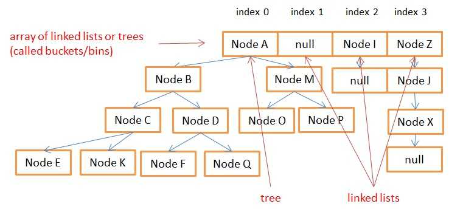

# HashMap 工作原理

[原文：How does a HashMap work in JAVA](http://coding-geek.com/how-does-a-hashmap-work-in-java/ 'How does a HashMap work in JAVA')

## 内部存储

interface Map<K, V>

- V put(K key, V value)
- V get(Object key)
- V remove(Object key)
- Boolean containsKey(Object key)

HashMaps 使用内部类 Entry<K, V>储存数据

```JAVA
static class Entry<K, V> implements Map.Entry<K, V>{
	final K key;
	V value;
	// 类似链表
	Entry<K, V> next;
	// 用来存储key的hash值，并决定entry的存储位置，若key的hash值改变可能无法get()
	int hash;
    ...
}
```

> A HashMap stores data into multiple singly linked lists of entries (also called buckets or bins). All the lists are registered in an array of Entry (Entry<K,V>[] array) and the default capacity of this inner array is 16.

**_数据存储在多个链表中，默认大小 16，默认加载因子 0.75。_**

| index 0  | index 1  | ... | index n  |
| :------: | :------: | :-: | :------: |
|  EntryA  | **null** | ... |  EntryZ  |
|  EntryB  |          |     | **null** |
|  EntryC  |
| **null** |

**_竖排构成链表，hash 值相同的在同一链表（桶）内。_**

链表的 index 产生分三步：

1.  获得 key 的 hashcode
2.  rehashcode（避免将所有 key 分配到同一个桶内）
3.  bit-masks（分配到有限的桶内）

```JAVA
// rehash in JAVA7
h^=(h>>>20)^(h>>>12);
return h^(h>>>7)^(h>>>4);
// rehash in JAVA8
return (key==null)? 0 : (h=key.hashCode())^(h>>>16);
// bit-masks
return h & (length-1);
```

## 自动扩容

> After getting the index, the function (get, put or remove) visits/**iterates** the associated linked list to see if there is an existing Entry for the given key.

获得链表 index 后，迭代在链表中查找 key。当数据量较大时，链表数量较少会影响效率，因此会 Auto resizing。检查是否需要扩容，涉及两个 data：

1.  size（updated when added or removed）
2.  threshold （下限 = 内部数组容量 \* 加载因子）

adding 前检查 size > threshold，若 true 则 array.size \* 2，并且重新分配桶。

## 线程（不）安全

由于自动扩容机制(auto-resizing mechanism)，可能找不到新桶。**HashTable**线程安全，但效率较差（废话！）。**ConcurrentHashMap**仅线程同步 buckets，多线可程考虑使用。

## 键的不可变性

String 和 Integer 是比较好的 key 实现，因为他们不可变(immutable)。如果使用自定义类作为 key，可能 lose data inside the HashMap。注意：HashMap 内保存的 Entity 内也保存的有 key 的 hash 值，若因 key 的属性改变从而导致 hash 值改变，则在 HashMap 内无法找到。

> the map first compares the hash values and then calls the equals() comparison

## JAVA8 的改进

array 由 Entity<K, V>改为 Node<K, V>，Node 可以被 extended 成 TreeNode（一种红黑树的数据结构，存储更多信息），add/delete/get 的复杂度为 O(log(n))。

```JAVA
static final class TreeNode<K,V> extends LinkedHashMap.Entry<K,V> {
    final int hash; // inherited from Node<K,V>
    final K key; // inherited from Node<K,V>
    V value; // inherited from Node<K,V>
    Node<K,V> next; // inherited from Node<K,V>
    Entry<K,V> before, after;// inherited from LinkedHashMap.Entry<K,V>
    TreeNode<K,V> parent;
    TreeNode<K,V> left;
    TreeNode<K,V> right;
    TreeNode<K,V> prev;
    boolean red;
    ...
}
```

> Red black trees are self-balancing binary search trees. Their inner mechanisms ensure that their length is always in log(n) despite new adds or removes of nodes. The main advantage to use those trees is in a case where many data are in the same index (bucket) of the inner table, the search in a tree will cost O(log(n)) whereas it would have cost O(n) with a linked list.  
> By inheritance, the inner table can contain both Node (linked list ) and TreeNode (red-black tree). Oracle decided to use both data structures with the following rules:

- If for a given index (bucket) in the inner table there are more than 8 nodes, the linked list is transformed into a red black tree
- If for a given index (bucket) in the inner table there are less than 6 nodes, the tree is transformed into a linked list



简言之：红黑树是自平衡的二分查找树，内部机制保证其为 log(n)的深度。对一个给定的桶，如果内部节点大于 8 个则将链表转换为红黑树，如果小于 6 个则将树转换为链表。

## 内存开销

### JAVA7

- An entry has: next_entry/hash/key/value
- inner array

etc: N elements + inner\*array.capacity=CAPACITY

memory cost is **approximately**: sizeOf(integer)\_N + sizeOf(reference)\*(3\*N+C)

### JAVA8

etc: all nodes are TreeNodes **(approximately)**:

N*sizeOf(integer) + N*sizeOf(boolean) + sizeOf(reference)*(9*N+C)

## 性能问题

### 平衡/不平衡的 HashMap

考虑**计算 hash 的方法**，最好情况下 get/put 方法时间复杂度为 O(1)，最差为 O(n)，此时所有的 entit 在一个桶内。

### 扩容的开销

如果需要存储很多数据，应该制定初始的 capacity。否则，第 12 次 put(16\*0.75)时将会应为 inner_array 的扩容（和内部链表或树的更新）而消耗很大的运算。

## 结论

> For simple use cases, you don’t need to know how HashMaps work since you won’t see the difference between a O(1) and a O(n) or O(log(n)) operation. But it’s always better to understand the underlaying mecanism of one of the most used data structures. Moreover, for a java developer position it’s a typical interview question.
