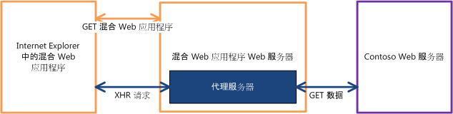
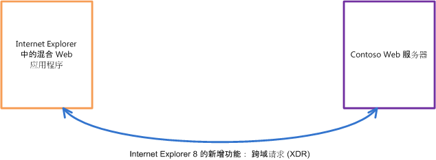
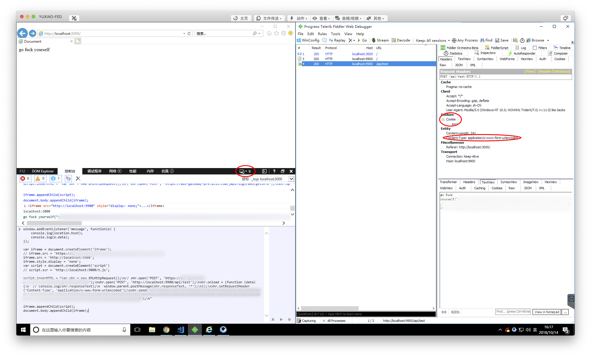

# IE9 借助 postMessage 实现跨域请求

这绝对不是一篇正经的 blog，完全是为了吐槽这个周末为了修复 IE9 兼容性问题而浪费的美好时光。这也肯定不是最优的解决方案，仅仅是从纯前端角度考虑的一个可行性方案。

## 先说问题

经过排查(显示确实做了不少工作)发现，IE9 在跨域请求时部分**请求头丢失**，导致后台服务器未能正确解析请求正文，从而返回异常处理结果。

不卖关子，出现问题的地方实际上是 `Content-Type` 丢失了，而恰好出现问题的请求 `Content-Type` 为 `application/x-www-form-urlencoded`，这时的请求正文实际上是类似 `location.search` 格式的字符串(猜想我们的后端大大直接用 `application/json` 做的解析)。由于未能正确解析请求正文，导致返回了异常处理结果。

## 再说原因

经过调研(显示确实做了不少工作)发现，IE8/IE9 在处理跨域的异步请求时，实际上并不是使用的 XHR(XMLHttpRequest) 对象，而是使用的 [XDR(XDomainRequest)](https://msdn.microsoft.com/zh-cn/library/dd573303) 对象。这个历史遗留(老不死)对象，可能是为了解决当时 IE8 不支持跨域请求，微软提供的产物。而且看其官方介绍，好像确实能简化设计。

before XDR:



after XDR:



我们项目在处理异步请求时，底层是交给 [axios](https://github.com/axios/axios) 进行的处理，按道理讲这东西有对 IE9 的支持，看源码也有用到 XDR 对象的。但为什么请求还是 gg 了？原来 XDR 有几处巨坑的地方：

1. **XDR 不支持自定义的请求头**
1. **XDR 不支持自定义的请求头**
1. **XDR 不支持自定义的请求头**
1. XDR 仅支持 GET 与 POST 这两种请求方式
1. 请求头的 `Content-Type` 只允许设置为 `text/plain`
1. 发起请求的时候，不会携带 `authentication` 或 `cookies`

## 已知结论

- (貌似)最优解

  把锅甩回后端，解析请求正文时多考虑点情况。

- jQuery (讲真，本来以为可能再不会看到这个东西了)

  jQuery(>=1.5) 并不能很好的支持 XDR，但是可以通过一些扩展增加对 IE8/IE9 的支持，例如：[jQuery-ajaxTransport-XDomainRequest](https://github.com/MoonScript/jQuery-ajaxTransport-XDomainRequest)。但是依旧不能解决，上面提到的 **自定义的请求头** 的问题。

- Node.js 中间层

  如果有这个条件，前端分分钟转全栈。但是我们公司没有，所以 PASS。

- Flash

  早期可能比较常用的解决方案，通过 Flash 中转去访问其他域的接口，条件只需要其他域的根目录下有一个 `crossdomain.xml` 文件，文件中设置允许所有域名或允许本域访问即可。可参考 [AJAXCDR](http://zyan.cc/ajaxcdr/)。

## 一点黑科技

作为一个有最求的 FEer 肯定不会就此打住，于是在 stack overflow 上发现了这个问题 [cross-origin header in IE8/IE9](https://stackoverflow.com/questions/9652364/cross-origin-header-in-ie8-ie9)。

自己考虑通过 `window.postMessage` 去实现，基本思路就是父级窗口监听 `message` 事件，然后加一个同源的 `iframe`，`iframe` 去发 `xhr`，然后通过 `postMessage` 回传。

跑了一下 demo 确实**自定义的请求头**和 `cookie` 都可以传过去。不想写了，看图吧。(不要问我大好的周末为啥不去拍照、为啥不去跑步、为啥不去吃好吃的，一切都在不言中...)



伪代码如下：

```js
window.addEventListener('message', function(e) {
  console.log(location.host);
  console.log(e.data);
});

var iframe = document.createElement('iframe');
iframe.src = 'http://localhost:9900';
iframe.style.display = 'none';

var script = document.createElement('script')
script.innerHTML = "var xhr = new XMLHttpRequest();\nxhr.open('POST', 'http://localhost:9900/api/test');\nxhr.onload = (function (data) {\n  window.parent.postMessage(xhr.responseText, '*');\n});\nxhr.setRequestHeader('Content-Type', 'application/x-www-form-urlencoded');\nxhr.send('some data');\n";

iframe.appendChild(script);
document.body.appendChild(iframe);
```

## 参考文档

1. [XDomainRequest – Restrictions, Limitations and Workarounds](https://blogs.msdn.microsoft.com/ieinternals/2010/05/13/xdomainrequest-restrictions-limitations-and-workarounds/)
1. [XDR 官方文档](https://msdn.microsoft.com/zh-cn/library/dd573303)
1. [IE9 下的跨域问题小总结](https://segmentfault.com/a/1190000008686327)
1. [MDN Using XMLHttpRequest](https://developer.mozilla.org/en-US/docs/Web/API/XMLHttpRequest/Using_XMLHttpRequest)
1. [AJAXCDR](http://zyan.cc/ajaxcdr/)
1. [cross-origin header in IE8/IE9](https://stackoverflow.com/questions/9652364/cross-origin-header-in-ie8-ie9)
1. [MDN window.postMessage](https://developer.mozilla.org/en-US/docs/Web/API/Window/postMessage)
1. [HTML5 postMessage 跨域交换数据](https://www.cnblogs.com/zichi/p/4638096.html)
