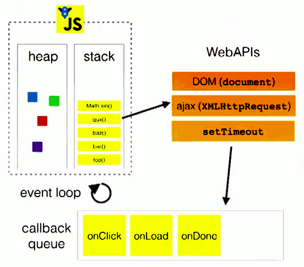
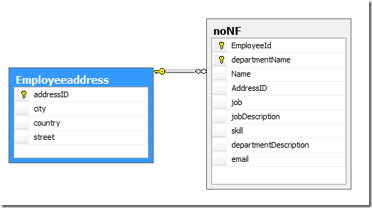
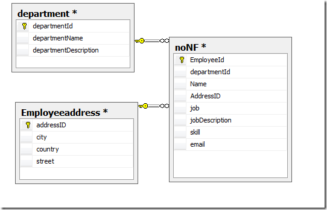
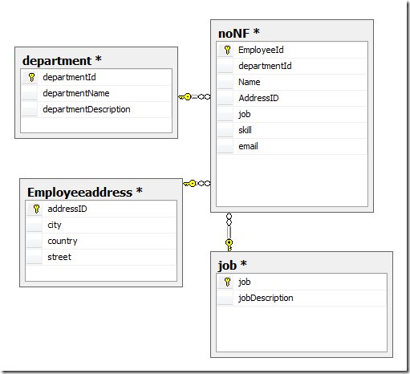
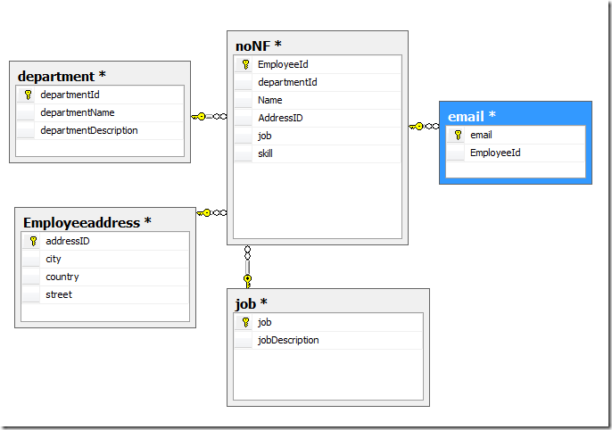
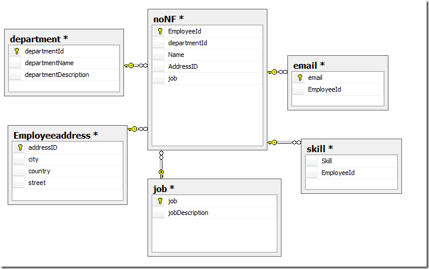

# Node.js 常见问题

## 基础问题

为什么 `undefined == null`

> 4\. If x is null and y is undefined, return true.

### 引用

**call-by-sharing**

> Instead, the situation is that the item passed in is passed by value. But the item that is passed by value is _itself_ a reference.

```js
function changeStuff(a, b, c) {
  a = a * 10;
  b.item = 'changed';
  c = { item: 'changed' };
}

var num = 10;
var obj1 = { item: 'unchanged' };
var obj2 = { item: 'unchanged' };

changeStuff(num, obj1, obj2);

console.log(num);
console.log(obj1.item);
console.log(obj2.item);
// 10 changed unchanged
```

### 内存释放

**when?**

1.  引用类型
1.  值（闭包）
1.  值（非闭包）

## 事件/异步

### Promise

1.  `.then` 的第一参数与 `catch` 区别在于就近与全局
1.  `new Promise()` 立即执行

```js
setTimeout(function() {
  console.log(1);
}, 0);

new Promise(function executor(resolve) {
  console.log(2);
  for (var i = 0; i < 10000; i++) {
    i == 9999 && resolve();
  }
  console.log(3);
}).then(function() {
  console.log(4);
});

console.log(5);
// 2 3 5 4 1
```

### Event

`fs`, `net`, `http` 模块依赖 `Stream` 基于 `Event`

> 通过继承 EventEmitter 来使得一个类具有 node 提供的基本的 event 方法，这样的对象可以称作 emitter ，而触发(emit)事件的 cb 则称作 listener  
> emitter 的触发不存在冒泡, 逐层捕获等事件行为

EventListener 按注册顺序同步调用 listener `emitter.on('key', foo); emitter.on('key', bar);`

### 阻塞/异步

> Node.js 中执行 js 代码的过程是单线程的. 只有当前代码都执行完, 才会切入事件循环, 然后从事件队列中 pop 出下一个回调函数开始执行代码

由此可以如下实现一个 sleep 函数

```js
function sleep(ms) {
  let start = Date.now(),
    expire = start + ms;
  while (Date.now() < expire);
  return;
}
```

### 任务队列

异步执行的运行机制如下：

> 1.  所有同步任务都在主线程上执行，形成一个执行栈（execution context stack）
> 1.  主线程之外，还存在一个"任务队列"（task queue）。只要异步任务有了运行结果，就在"任务队列"之中放置一个事件
> 1.  一旦"执行栈"中的所有同步任务执行完毕，系统就会读取"任务队列"，看看里面有哪些事件。那些对应的异步任务，于是结束等待状态，进入执行栈，开始执行
> 1.  主线程不断重复上面的第三步



栈中的代码调用外部 API，在"任务队列"中加入事件。当栈中代码执行完毕，主线程去“任务队列”依次执行回调函数。因此：

> 指定回调函数的部分（onload 和 onerror），在 send()方法的前面或后面无关紧要

同理，`setTimeout` 只是将事件插入了“任务队列”，必须等待执行栈执行完。

Node.js 中 `process.nextTick` 在当前执行栈尾部添加事件，`setImmediate` 在任务队列后添加事件。

## 模块

### 模块机制

#### 上下文

每个 node 进程只有一个 VM 的上下文，`.js` 独立一个环境，是因为 node 在外层包了一圈自执行

```js
// b.js
(function(exports, require, module, __filename, __dirname) {
  t = 111;
})();

// a.js
(function(exports, require, module, __filename, __dirname) {
  // ...
  console.log(t); // 111
})();
```

#### 循环加载

`a.js; b.js` 相互依赖，`module.exports` 和 `exports` 的区别，决定了相互引用时未执行完的一方被引用时拿到的是 {}

##### CommonJS 模块的加载原理

`require` 命令第一次加载该脚本，就会执行整个脚本，然后在内存生成一个对象。需要用到这个模块的时候，就会到 `exports` 属性上面取值。CommonJS 模块无论加载多少次，都只会在第一次加载时运行一次。CommonJS 输入的是被输出值的拷贝，不是引用。

简言之，`a.js` 执行过程中遇到 `require(b)` 则去执行 `b.js` 此时 `require(a)` 只拿到已执行完的部分。

##### ES6 模块的循环加载

ES6 模块是动态引用，`import` 加载从模块加载变量，变量不会被缓存，而是成为一个指向被加载模块的引用。

简言之，`a.js` 执行过程中遇到从 `b.js` `import` 的方法 `foo` 会到 `b.js` 中执行 `foo`。

### 热更新

代码中 `require` 会拿到之前的编译好缓存在 v8 内存 (code space) 中的的旧代码，清除 `catch` 再次 `require` 可在**局部**拿到新代码。

## 进程

### process 对象

```js
console.log(process); // process 对象

function test() {
  // 递归调用 process.nextTick 导致 任务队列阻塞？
  process.nextTick(() => test());
}
```

通过环境变量指定配置时，可以通过 `process.env` 获取配置。在使用配置文件时，可使用 `process.cwd()` 拿到 current working directory，通过 `process.chdir()` 改变当前工作目录。

process 同时提供了三个标准流：`process.stderr`， `process.stdout` 以及 `process.stdin`。

```js
var obj = {};
console.log(obj);
obj.foo = 'bar';
// WebKit 环境 console.log 只储存 obj 的引用
// 代码进入事件队列时才进行快照 异步表现
// Node 环境下 严格同步
```

### Child Process

可通过 Node.js 的 `child_process` 模块执行文件（调用命令行）等。 pomelo 通过此模块实现分布式架构。

由此引出几种进程：

- 父进程
  - 死亡时，若子进程可运行或僵死，子进程被 init 进程收养，成为孤儿进程
- 子进程
  - 死亡后，向父进程发送死亡信号
  - 死亡时，父进程未 `wait()`，则残留在 `PCB` 形成僵尸进程
- 孤儿进程
- 僵尸进程

### Cluster

基于 `child_process.fork()` 实现多核办法，通过 IPC 通讯，通过 `cluster.isMaster` 标识（不拷贝父进程空间，父进程的变量等）。

```js
const cluster = require('cluster');            // | | 
const http = require('http');                  // | | 
const numCPUs = require('os').cpus().length;   // | |    都执行了
                                               // | | 
if (cluster.isMaster) {                        // |-|-----------------
  // Fork workers.                             //   | 
  for (var i = 0; i < numCPUs; i++) {          //   | 
    cluster.fork();                            //   | 
  }                                            //   | 仅父进程执行 (a.js)
  cluster.on('exit', (worker) => {             //   | 
    console.log(`${worker.process.pid} died`); //   | 
  });                                          //   |
} else {                                       // |-------------------
  // Workers can share any TCP connection      // | 
  // In this case it is an HTTP server         // | 
  http.createServer((req, res) => {            // | 
    res.writeHead(200);                        // |   仅子进程执行 (b.js)
    res.end('hello world\n');                  // | 
  }).listen(8000);                             // | 
}                                              // |-------------------
                                               // | |
console.log('hello');                          // | |    都执行了
```

以上代码 `a.js` 执行了一次，`b.js`执行了 `numCPUs` 次，cluster 模块作为桥梁，让二者实现沟通。

### 进程间通信

IPC (Inter-process communication) 进程间通信技术。

> Node.js 中的 IPC 通信是由 libuv 通过管道技术实现的, 在 windows 下由命名管道（named pipe）实现，\*nix 系统则采用 UDS (Unix Domain Socket) 实现。普通的 socket 是为网络通讯设计的，网络本身是不可靠的。为 IPC 设计的 socket 默认本地的网络环境是可靠的, 所以可以简化大量不必要的 encode/decode 以及计算校验等, 得到效率更高的 UDS 通信。

IPC 通道建立之前, 父进程与子进程通信？ env ?

### 守护进程

实现一个守护进程：

- 创建一个进程 A
- 在进程 A 中创建进程 B
- 对进程 B 执行 setsid 方法
  - 该进程变成一个新会话的会话领导
  - 该进程变成一个新进程组的组长
  - 该进程没有控制终端
- 进程 A 退出，进程 B 由 init 进程接管（此时 B 为守护进程）

```js
var spawn = require('child_process').spawn;
var process = require('process');

var p = spawn('node', ['endless.js'], {
  detached: true,
});
console.log(process.pid, p.pid);
process.exit(0); // 此时 process 已关闭，p 执行完后关闭
```

## IO

### Buffer

> Buffer 是 Node.js 中用于处理二进制数据的类, 其中与 IO 相关的操作 (网络/文件等) 均基于 Buffer

### String Decoder

> 字符串解码器 (String Decoder) 是一个用于将 Buffer 拿来 decode 到 string 的模块, 是作为 Buffer.toString 的一个补充, 它支持多字节 UTF-8 和 UTF-16 字符

### Console

关于 Console 异步/同步的两个说法:

> `console.log` 正常情况下是异步的, 除非使用 `new Console(stdout[, stderr])` 指定了一个文件为目的地
> `console.log` is not standardized, so the behavior is rather undefined, and can be changed easily from release to release of the developer tools.
> [stackoverflow: console-log-async-or-sync](https://stackoverflow.com/questions/23392111/console-log-async-or-sync)

简单实现 `console.log`

```js
const print = str => process.stdout.write(str + '\n');
print('hello world');
```

### File

Unix/Linux 的基本哲学之一：“一切皆是文件”（文件、目录、字符设备、块设备、套接字等）。

> 在 shell 上运行一个应用程序的时候, shell 做的第一个操作是 fork 当前 shell 的进程 (所以, 如果你通过 ps 去查看你从 shell 上启动的进程, 其父进程 pid 就是当前 shell 的 pid), 在这个过程中也把 shell 的 stdio 继承给了你当前的应用进程, 所以你在当前进程里面将数据写入到 stdout, 也就是写入到了 shell 的 stdout, 即在当前 shell 上显示了  
> 当你使用 ssh 在远程服务器上运行一个命令的时候, 在服务器上的命令输出虽然也是写入到服务器上 shell 的 stdout, 但是这个远程的 shell 是从 sshd 服务上 fork 出来的, 其 stdout 是继承自 sshd 的一个 fd, 这个 fd 其实是个 socket, 所以最终其实是写入到了一个 socket 中, 通过这个 socket 传输你本地的计算机上的 shell 的 stdout

同步的获取用户的输入（伪代码）

```js
var fs = require('fs');
var BUFSIZE = 256;
var buf = new Buffer(BUFSIZE);
var bytesRead;

bytesRead = fs.readSync(fd, buf, 0, BUFSIZE);
return buf.toString(null, 0, bytesRead - 1);
```

### Readline

> `readline` 模块提供了一个用于从 Readble 的 stream (例如 process.stdin) 中一次读取一行的接口

```js
const readline = require('readline');
const fs = require('fs');

const rl = readline.createInterface({
  input: fs.createReadStream('hello.js'),
});

rl.on('line', line => {
  console.log(`Line from file: ${line}`);
});
```

如何实现？ `input.on('keypress', onkeypress)` / `regExp.test` ?

## Network

### 粘包

TCP 延迟传送算法（Nagle 算法）将短时间内的多个数据缓存到一起，一次性发送。

在处理多条消息时，2-4 情况为粘包情况（send 分别 data1 data2）：

1.  data1, data2
1.  data1_p1, data1_p2 + data2
1.  data1 + data2_p1, data2_p2
1.  data1 + data2

对应常见的解决方案：

1.  多次发送之前间隔一个等待时间
1.  关闭 Nagle 算法
1.  进行封包/拆包（包前后加特征的数据）

### 可靠传输

(SYN, Synchronise packet) + (ACK, Acknowledgedgement) 机制。  
接收方通过 SYN 序号来保证数据的不会乱序(reordering), 发送方通过 ACK 来保证数据不缺漏, 以此参考决定是否重传。

### UDP

TCP/UDP 的区别（传输层协议）

| 协议 |            连接性             |   双工性    |         可靠性         |       有序性        |       有界性       | 拥塞控制 | 传输速度 | 量级 |  头部大小  |
| :--: | :---------------------------: | :---------: | :--------------------: | :-----------------: | :----------------: | :------: | :------: | :--: | :--------: |
| TCP  | 面向连接(Connection oriented) | 全双工(1:1) |     可靠(重传机制)     | 有序(通过 SYN 排序) |   无, 有粘包情况   |    有    |    慢    |  低  | 20~60 字节 |
| UDP  |    无连接(Connection less)    |     n:m     | 不可靠(丢包后数据丢失) |        无序         | 有消息边界, 无粘包 |    无    |    快    |  高  |   8 字节   |

### HTTP

> RESTful 是把每个 URI 当做资源 (Resources), 通过 **method** 作为动词来对资源做不同的动作, 然后服务器返回 status 来得知资源状态的变化 (State Transfer)  
> 协议 (protocol) 这种东西就是人与人之间协商的约定, 什么行为是什么作用都是"约定"好的, 而不是强制使用的

讨论 GET 和 POST 的区别，可以从 RESTful 提倡的语义角度考虑。

一些关于 HTTP/1.1 的补充：

1.  引入了持久连接（persistent connection），即 TCP 连接默认不关闭
1.  引入了管道机制（pipelining），即在同一个 TCP 连接里面，客户端可以同时发送多个请求
1.  `Content-length` 字段声明本次回应的数据长度
1.  可以不使用 `Content-Length` 字段，而使用"分块传输编码"（chunked transfer encoding）
1.  每个非空的数据块之前，会有一个 16 进制的数值，表示这个块的长度

一些关于 RESTful 的补充

1.  Representational State Transfer 表现层状态转化
1.  Resources 资源 （被省略的主语） URI 就成了作为每一个资源的地址或独一无二的识别符
1.  Representation 表现层 资源的具体呈现形式 Accept 和 Content-Type 字段指定
1.  State Transfer 状态转化 HTTP 无状态 客户端想要操作服务器，必须通过某种手段（method），让服务器端发生"状态转化"

### headers

> session 存在服务端， cookie 存在客户端。服务端可以通过设置 cookie 的值为空并设置一个及时的 expires 来清除存在客户端上的 cookie  
> 由于同源性策略 (CORS), 如果引用的 js 脚本所在的域与当前域不同, 那么浏览器会把 onError 中的 msg 替换为 Script error

### DNS

> .lookup 查询直接调用 `getaddrinfo` 来拿取地址, 速度很快, 但是如果本地的 hosts 文件被修改了, .lookup 就会拿 hosts 文件中的地方, 而 .resolve 依旧是外部正常的地址  
> 浏览器缓存 => 本地 hosts 文件 => DNS 服务器

## OS

### TTY

原意是指 teletype 即打字机，在 Unix 中指任何表现像打字机的设备，如 terminal

### OS

常用方法： os.arch/constants/cpus/endianness/homedir/hostname/loadavg/platform()

EOL: end of line LF(\n) / CR(\r)

### Path

Windows vs. POSIX

例如： `path.posix.sep == '/'` <-> `path.win32.sep == '\\'`  
其他常用方法： path.{posix/win32}.normalize/basename/join/relative()  
常量： sep/delimiter/PATH

## 错误处理

### Errors

NOde.js 中四种主要错误：

1.  Standard JavaScript errors
1.  System errors
1.  User-specified errors (`throw`)
1.  Assertion errors

主要处理方法：

- callback(err, data) 回调约定 | 繁琐且不具备强制性
- throw / try / cathc
- EventEmitter 的 error 事件 | 监听 http server 等对象的 `error` 事件
- ~~使用 Promise 封装异步~~

错误是一个 Error 实例，抛出后成为异常 `throw new Error()` <-> `callback(new Error())`

### 错误栈丢失

> 当使用 `setImmediate` 等定时器来设置异步的时候，错误栈中仅输出到 test 函数内调用的地方位置, 再往上 main 的调用信息就丢失了

### 防御性编程

> 防御性编程是一种编程习惯，是指预见在什么地方可能会出现问题，然后创建一个环境来测试错误，当预见的问题出现的时候通知你，并执行一个你指定的损害控制动作

### uncaughtException

> 当异常没有被捕获一路冒泡到 Event Loop 时就会触发该事件 process 对象上的 `uncaughtException` 事件. 默认情况下, Node.js 对于此类异常会直接将其堆栈跟踪信息输出给 `stderr` 并结束进程, 而为 `uncaughtException` 事件添加监听可以覆盖该默认行为, 不会直接结束进程  
> `uncaughtException` 的初衷是可以让你拿到错误之后可以做一些回收处理之后再 process.exit

```js
process.on('uncaughtException', err => {
  console.log(`Caught exception: ${err}`);
});
```

### unhandledRejection

> 当 Promise 被 reject 且没有绑定监听处理时, 就会触发该事件

```js
process.on('unhandledRejection', (reason, p) => {
  console.log('Unhandled Rejection at: Promise', p, 'reason:', reason);
  // application specific logging, throwing an error, or other logic here
});
```

## 测试

### 测试方法

- 黑盒测试（测试功能）
  - 集成测试 Integration Testing
  - 系统测试 System Testing
- 白盒测试（测试程序内部结构或运作）
  - 单元测试 Unit Testing
  - 集成测试
  - 系统的软件测试

### 单元测试

- Unit 过程化编程中的单个程序、函数、过程，面向对象中的基类、抽象类、子类中的方法
- 覆盖率 (Test Coverage) 行/函数/分支/语句覆盖率
- Mock 模拟测试对象可能依赖的其他对象

### Assert

> 快速判断并对不符合预期的情况进行报错的模块

```js
if (condition) {
  throw new Error('Sth wrong');
}

assert(!condition, 'Sth wrong');
```

## util

href:

- protocol + auth + host + path + hash
  - host: hostname + port
  - path: pathname + search
- http :// user:pass @ host.com : 8080 / path ? query=string # hash

转义字符： `encodeURI()`

## 储存

### 数据库范式

目标：减少冗余、消除异常、数据组织和谐

#### 1NF

> 如果一个关系模式 R 的所有属性都是不可分的基本数据项，则 R∈1NF

每个属性都不可再分，例如 Address 可再分为 city/country/street...



#### 2NF

> 若关系模式 R∈1NF，并且每一个非主属性都完全函数依赖于 R 的码，则 R∈2NF

表中的属性必须全部依赖于全部主键，而不是部分主键。例如 departmentDescription 依赖主键 departmentName 但不依赖主键 EmployeeID



#### 3NF

> 关系模式 R<U，F> 中若不存在这样的码 X、属性组 Y 及非主属性 Z（Z  Y）, 使得 X→Y，Y→Z，成立，则称 R<U，F> ∈ 3NF

第  三范式为了消除数据库中关键字之间的依赖关系。例如 jobDescription 依赖 job



#### BCNF

> 设关系模式 R<U，F>∈1NF，如果对于 R 的每个函数依赖 X→Y，若 Y 不属于 X，则 X 必含有候选码，那么 R∈BCNF

BC 范式是第三范式的特殊情况，既每个表**只有一个**候选键（每行值不相同），例如 email 是唯一的



#### 4NF

> 关系模式 R<U，F>∈1NF，如果对于 R 的每个非平凡多值依赖 X→→Y（Y  X），X 都含有候选码，则 R∈4NF

第四范式是消除表中的多值依赖，减少维护数据一致性的工作，例如 skill 可能第一个值是 "C#" 和 第二个值是 "C# .net" 造成内容不一致（一对多？）



### MySql

储存引擎：

|      attr       |     MyISAM     |        InnoDB         |
| :-------------: | :------------: | :-------------------: |
|     Locking     |  Table-level   |       Row-level       |
|  designed for   | need of speed  |  high volume of data  |
|  foreign keys   |    × (DBMS)    |       ✓ (RDBMS)       |
|   transaction   |       ×        |           ✓           |
| fulltext search |       ✓        |           ×           |
|      scene      | lots of select | lots of insert/update |
|   count rows    |      fast      |         slow          |
| auto_increment  |      fast      |         slow          |

索引类型：

- normal
- unique
- full text

### 数据一致性

读写分离？M/M？M/S？

#### 事务

两阶段提交（数据库/分布式系统）：

> 第一阶段：
>
> - 协调者会问所有的参与者结点，是否可以执行提交操作。
> - 各个参与者开始事务执行的准备工作：如：为资源上锁，预留资源，写 undo/redo log……
> - 参与者响应协调者，如果事务的准备工作成功，则回应“可以提交”，否则回应“拒绝提交”。
>
> 第二阶段：
>
> - 如果所有的参与者都回应“可以提交”，那么，协调者向所有的参与者发送“正式提交”的命令。参与者完成正式提交，并释放所有资源，然后回应“完成”，协调者收集各结点的“完成”回应后结束这个 Global Transaction。
> - 如果有一个参与者回应“拒绝提交”，那么，协调者向所有的参与者发送“回滚操作”，并释放所有资源，然后回应“回滚完成”，协调者收集各结点的“回滚”回应后，取消这个 Global Transaction。
>
> 异常：
>
> - 如果第一阶段中，参与者没有收到询问请求，或是参与者的回应没有到达协调者。那么，需要协调者做超时处理，一旦超时，可以当作失败，也可以重试。
> - 如果第二阶段中，正式提交发出后，如果有的参与者没有收到，或是参与者提交/回滚后的确认信息没有返回，一旦参与者的回应超时，要么重试，要么把那个参与者标记为问题结点剔除整个集群，这样可以保证服务结点都是数据一致性的。
> - 第二阶段中，如果参与者收不到协调者的 commit/fallback 指令，参与者将处于“状态未知”阶段，参与者完全不知道要怎么办。

### 缓存

redis 与 memcached 区别：

|     attr     |    memcached    |              redis               |
| :----------: | :-------------: | :------------------------------: |
|    struct    |    key/value    | key/value + list, set, hash etc. |
|    backup    |        ×        |                ✓                 |
| Persistence  |        ×        |                ✓                 |
| transcations |        ×        |                ✓                 |
| consistency  | strong (by cas) |               weak               |
|    thread    |      multi      |              single              |
|    memory    |    physical     |         physical & swap          |

## 安全

### Crypto

### TLS/SSL

Secure Socket Layer & Transport Layer Security

SSL 的主要用途：

1.  认证用户和服务器, 确保数据发送到正确的客户机和服务器;
1.  加密数据以防止数据中途被窃取;
1.  维护数据的完整性, 确保数据在传输过程中不被改变.

三个特性：

- 机密性：SSL 协议使用密钥加密通信数据
- 可靠性：服务器和客户都会被认证, 客户的认证是可选的
- 完整性：SSL 协议会对传送的数据进行完整性检查

### HTTPS

### XSS

Cross-Site Scripting 跨站脚本可通过 img.src / Ajax / onclick 等事件方式实现，通过编码转换绕过检查。

```js
<table background="javascript:alert(/xss/)"></table>


```

#### CSP

Content Security Policy 网页安全政策

> CSP 的实质就是白名单制度，开发者明确告诉客户端，哪些外部资源可以加载和执行，等同于提供白名单。它的实现和执行全部由浏览器完成，开发者只需提供配置。

1.  通过 HTTP 头信息的 `Content-Security-Policy` 的字段
1.  通过网页的 `<meta>` 标签

### CSRF

Cross-Site Request Forgery 跨站请求伪造

- 通源检查
  - Origin Header
  - Referer Header
- CSRF token
  - 算法生成 token 存在 session 隐藏在表单中

### MITM

Man-in-the-middle attack 中间人攻击

### SQL/NoSQL 注入

SQL `'; DROP TABLE users; --`

NoSQL

```js
let { user, pass, age } = ctx.query;

db.collection.find({
  user,
  pass,
  $where: `this.age >= ${age}`,
});
```
