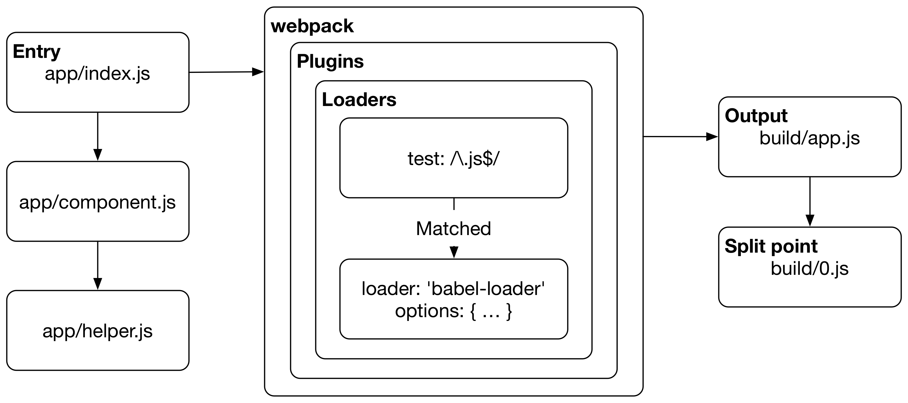

# 前端工程化系列课程（一）

<!--公司培训分享大纲-->

> # 课程安排
>
> ## 第一课
>
> - 概述工程化方向的主要内容
> - 从源码到浏览器端可执行发生了什么
> - 前端模块化的一般方法
> - webpack 简单介绍
> - webpack Bootstrap 原理介绍
>
> ## 第二课
>
> - 编写 loader
> - 编写 plugin
> - 调试 webpack
> - 模块化中常用的优化方法
> - 主站构建及加载过程中部分优化策略介绍

# 概述

## 课程定位

- 介绍前端工程化的主要内容
- 介绍 webpack 是什么，解密 **webpackBootstrap** 原理
- 介绍主站构建及加载过程中部分优化策略

## 工程化解决哪些问题

都说前端其实是个特别苦逼的职业，学校里没有专门的课程，但是新技术、新技巧却在不断地被发明出来。回顾十年前的前端开发，HTML、CSS、JavaScript 三剑客，加个 jQuery 就能走天下。如果说那时候是田园时代，那如今随着各种层出不穷的大神级文明(新框架、新语言)， Web 应用日益复杂，前端开发也发生了翻天覆地的变化。


以前我们用编码就能解决问题，后来复杂到我们需要考虑架构设计。再到后来，当系统规模更大，光靠一个人，是没办法完成的，如何保证开发人员之间能互相能够配合好？如何保证项新人能迅速接手开发？我们需要考虑**前后端解耦、模块化、质量保证、代码风格**等等，于是工程化应运而生。

## 工程化包括哪些内容

### 规范化

当团队不断扩充时，我们需要制定统一的规范来对平时的开发工作做出一定约束和指导。统一的规范包括前端的代码规范，根据规范定义好一套代码检查的规则，在代码提交的时候进行检查，让开发人员知道自己的代码情况。这其中主要有：

- 目录结构制定、文档规范


- 编码规范 [ESLint](https://eslint.org/)、[StyleLint](https://stylelint.io/)
- Git 分支管理、Commit 描述规范
- Code Review

### 组件化

首先，组件化 ≠ 模块化。模块化只是在文件层面上，对代码或资源的拆分；而组件化是在设计层面上，对 UI 的拆分。包括完整的模版、样式和业务逻辑。

### 模块化

模块化通过将一个大文件拆分成相互依赖的小文件，再进行统一的拼装和加载。也正是模块化的实现，才使多人协作成为可能。在 ES6 之前，JavaScript 一直没有模块系统，因此社区制定了各种模块加载方案。比如：命名空间、AMD、CommonJS、UMD 等。

### 自动化

工程化的最终目标是部署上线，前端代码的运行环境为浏览器。由于原生的 HTML、CSS、JavaScript 效率并不高，于是出现了模版引擎、PostCSS、LESS、SASS、Flow/TypeScript 等中间型语言用于转义为原生的语言(包括 ES6)，所以构建过程中我们需要在合适的时机对其进行转义。再者，在开发过程中，开发者希望在编码时，能够立马在浏览器中反应出变化，这又要求了自动刷新。同时在开发中，还面临过着依赖管理，性能优化等方面的问题。于是我们会考虑将下面这些工作，实现为自动化处理：

- 自动构建
- 自动发布
- 自动测试
- 雪碧图自动合并
- SVG 自动合并
- WebP 图片自动转换
- WebP 样式自动生成
- 样式文件自动合并
- 模版片段自动生成
- 开发环境自动热加载

## 主站 CI/CD 工作流介绍


- 静态检查
  - php-lint
  - freemarker-lint
  - sonar
- 构建
  - install
  - **build**
  - minify
  - convert-webp
  - deploy
- 统计分析
  - statistics
  - size-report
  - build-statistic

# webpack 是什么

> webpack 是一个打包模块化 JavaScript 的工具，在 webpack 里一切文件皆模块，通过 loader 转换文件，通过 plugin 注入钩子，最后输出由多个模块组合成的文件。Webpack 专注于构建模块化项目。


上图所体现的就是打包的功能，它能解决模块间相互依赖的问题，把乱成一锅粥的文件打包成清晰的文件，快刀斩乱麻！

## 执行流程

webpack 将所有文件视为模块，执行时需要指定入口(entry)和输出(output)。构建程序从用户定义的入口模块开始，递归的拿到所有模块，构成依赖图(dependency graph)，然后将所有这些依赖输出成一个或多个 bundle。简单流程如下：



完整流程，可参考淘宝前端团队整理的这张 [webpack 整体流程图](https://img.alicdn.com/tps/TB1GVGFNXXXXXaTapXXXXXXXXXX-4436-4244.jpg)，其中主要流程包括：

1. 初始化参数：从配置文件和 Shell 语句中读取与合并参数，得出最终的参数；
1. 开始编译：用上一步得到的参数初始化 Compiler 对象，加载所有配置的插件，执行对象的 run 方法开始执行编译；
1. 确定入口：根据配置中的 entry 找出所有的入口文件；
1. 编译模块：从入口文件出发，调用所有配置的 loader 对模块进行翻译，再找出该模块依赖的模块，再递归本步骤直到所有入口依赖的文件都经过了本步骤的处理；
1. 完成模块编译：在经过第 4 步使用 loader 翻译完所有模块后，得到了每个模块被翻译后的最终内容以及它们之间的依赖关系；
1. 输出资源：根据入口和模块之间的依赖关系，组装成一个个包含多个模块的 Chunk，再把每个 Chunk 转换成一个单独的文件加入到输出列表，这步是可以修改输出内容的最后机会；
1. 输出完成：在确定好输出内容后，根据配置确定输出的路径和文件名，把文件内容写入到文件系统。

> 如何构建依赖图？

webpack 在处理文件之前，会将文件按对应的配置规则交给 loader 处理。拿到 loader 处理后的文件，使用 [acorn](https://github.com/acornjs/acorn/tree/master/acorn) 生成 [AST](https://en.wikipedia.org/wiki/Abstract_syntax_tree) 并进行遍历，当遇到 `require` 和 `import` 等引用时，对其引用的路径，按配置规则进行 `resolve` 以后作为依赖模块进行处理。

> 循环依赖怎么办？

遵循 CommonJS 的处理方式，拿到一个**未完成的拷贝**([unfinished copy](https://nodejs.org/dist/latest-v10.x/docs/api/modules.html#modules_cycles))。

## 核心概念

webpack 是一个基于配置的驱动的构建工具，由 4 部分核心内容组成：

- entry

  指定入口。

- output

  输出配置。

- loader

  loader 提供文件(模块)层面的操作。webpack 自身只支持 JavaScript。而 loader 能够让 webpack 处理那些非 JavaScript 文件，并且先将它们转换为有效模块，然后添加到依赖图中。

- plugin

  plugin 借助 webpack 设计的 Tabable 机制，可以在更广的范围提供接触并修改构建产物的机会。从而实现诸如：打包优化、资源管理和注入环境变量等工作。

## 处理 JavaScript

webpack 对 JavaScript 提供开箱即用的支持，并且按照约定优于配置的理念，提供“0”配置的打包体验。让我们可以很快速的创建一个项目，并完成打包：

```bash
mkdir webpack-magic && cd webpack-magic
npm init -y
npm i webpack webpack-cli
mkdir src
echo "export default 42;" > src/answer.js
echo "import answer from './answer';" > src/index.js
echo "console.log('The answer to life, the universe and everything is', answer);" >> src/index.js
```

使用 `npx webpack` 按默认配置进行构建，不出意外话即可在 `dist` 目录看到 `main.js` 文件。将其拷贝至浏览器的 `console` 或者直接在 Node.js 环境下运行 `node dist/main.js` 即可看到输出：

```
The answer to life, the universe and everything is 42
```

## webpackBootstrap 原理介绍

通过上面简单的步骤，我们便实现了将 `answer.js` 和 `index.js` 打包到一起的目的。观察上面输出的 `main.js` 可以看到，除了我们写的 3 行代码，还有大量 webpack 注入的代码。这些代码就是所谓的 webpackBootstrap，也就是 webpack 对于模块化的实现方式。也正是基于 webpackBootstrap 使得我们可以把不同模块打包到一起并且保证互不会影响。下面就让我们一切看一下 webpackBootstrap 是怎样实现这一切的。

> 以下代码片段，使用 `index.js` 作为 entry 进行构建，运行时是否会抛错？

```js
// counter.js
var counter = window.counter || { t: 0 };
window.counter = counter;
if (counter.t > 0) throw new Error();
export default counter;

// A.js
import counter from './counter.js';
counter.t++;
console.log('in A:', counter.t);

// B.js
import counter from './counter.js';
counter.t++;
console.log('in B:', counter.t);

// index.js
import './A';
import './B';
```

> 该部分正文参照 [详解 webpackBootstrap.md](https://github.com/Rainsho/blog/blob/master/articles/%E8%AF%A6%E8%A7%A3webpackBootstrap.md)。

## 处理资源

// TODO 准备 demo102

# webpack 高级用法

## 编写 loader

webpack 可以使用 loader 来预处理文件，loader 的本质是一个模块转换方法。一个最简单的 loader 源码如下：

```js
module.exports = function(source) {
  return source;
};
```

## 编写 plugin

plugin 借助 webpack 的 Tapable 机制，使得其能够 hook 住编译中触发的所有关键事件。在编译的每一步，插件都具备完全访问 compiler 对象的能力，在某些事件点时还可以访问当前 compilation 对象。

> compiler 和 compilation 的区别
>
> compiler 对象包含了 webpack 环境所有的的配置信息，包含 options、loaders、plugins，可以简单地把它理解为 webpack 实例；而 compilation 对象包含了当前的模块资源、编译生成资源、变化的文件等。

plugin 的本质就是事件监听器，和 Node.js 中的 EventEmitter 类似。根据需要在整个 webpack 事件流的合适阶段予以介入。同时由于 plugin 可以拿到 compiler 和 compilation 对象，而两者均继承自 Tapable，故插件本身也可以广播新事件，供其他插件监听。一个最简单的 plugin 源码如下：

```js
module.exports = class DemoPlugin {
  constructor(options) {
    this.options = options;
  }
  apply() {
    console.log('apply', this.options);
  }
};
```

## 常用优化方法

### 使用 DllPlugin

### 缓存及并发

### 提取公共代码

### 按需加载

### 输出分析

## 实际案例

### 拆分公共代码

### 样式文件分组

# 参考资料

- [深入浅出 Webpack](http://webpack.wuhaolin.cn/)
- [Webpack Book](https://survivejs.com/webpack/introduction/)
- [Webpack 4.X 从入门到精通](https://cloud.tencent.com/info/d6ca7c72f3389de6f073ff3afc7dcc0a.html)
- [细说 webpack 之流程篇](http://taobaofed.org/blog/2016/09/09/webpack-flow/)
- [玩转 webpack](https://lxzjj.github.io/2017/11/02/%E7%8E%A9%E8%BD%ACwebpack%EF%BC%88%E4%B8%80%EF%BC%89/)
- [一个前端的自我修养](http://taobaofed.org/blog/2016/03/23/the-growth-of-front-end/)
- [详解 webpackBootstrap](https://github.com/Rainsho/blog/blob/master/articles/%E8%AF%A6%E8%A7%A3webpackBootstrap.md)
- [webpack 官网](https://webpack.js.org/)
- [我为什么这么强调前端工程化](https://segmentfault.com/a/1190000007414499)
