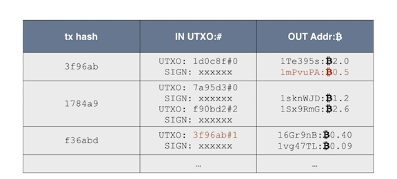
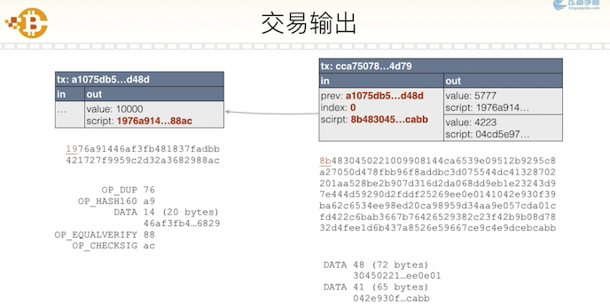
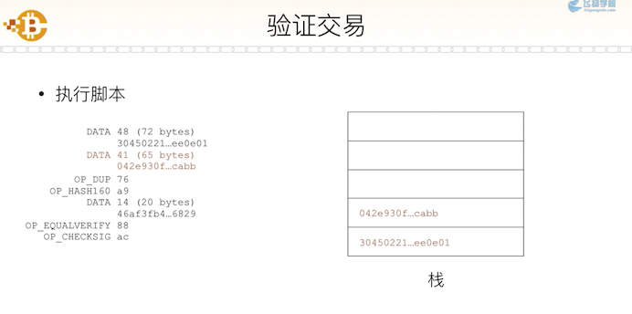

# 数字货币与区块链原理

原视频: [数字货币与区块链原理](https://www.feiyangedu.com/course/1bhmuur980ag081003l8)

## 数字货币

数字货币是**基于数学加密原理**构建的**不可伪造**的货币系统。区别于电子货币(法币)。

比特币特点:

- 无需信任中心的发行机制
- 数量由程序决定，无法随意修改
- 交易账本公开可追溯，不可篡改
- 密码学理论保证货币防伪造、放双花
- 数字签名机制保证交易可信，不可抵赖和撤销

用户通过钱包软件将交易发送至 P2P 网络，由旷工打包。用户交易记录在全网总账本中，且每一页新记录都指向上一页记录，称为**区块链**，账本在每个节点进行复制。

## 区块链

- 区块链就是一个不断增长的全网总账本
- 每个节点都拥有完整的区块链
- 节点总是信任最长的区块链
- 伪造区块链需要拥有超过 51%的全网算力

一个区块包含: 区块 Hash -- 上衣区块 Hash -- Merkle Hash -- 交易记录

1.  哈希算法

单向函数，将任意长度输入转化为固定长度输出。低碰撞率(输入无限，输出有限)。输出无规律。

常用哈希算法: MD5(128 bit = 16 bytes) / RipeMD160(160) / SHA-1(160) / SHA-256(256) / SHA-512(512)

比特币使用 hash256 (两次 SHA-256) 和 hash160 (先 SHA-256 再 RipeMD160)

2.  区块结构

Merkle Hash: dhash(dhash(tx1) + dhash(tx2)) 若无 tx2 则复制 tx1

Block Hash: 通过计算头部信息得到 hash256(Version, Prev Hash, ...)

Prev Hash: 指向上一区块

修改任意交易导致 Merkle Hash 验证不通过，重新计算导致 Block Hash 改变，使得下一区块的 Prev Hash 链接断裂。

## P2P 交易

验证声明由申明者发出且申明者拥有相应余额，即为可信交易。

### 数字签名

签名是为了验证某个申明是由某人发出。

SK (Secret Key / Private Key) / PK (Public Key)

私钥签名 `signature = sign(message, SK)` ，公钥验证 `verify(message, signature, PK)` 。

常用签名算法: RSA / DSA / ECDSA(比特币使用)。

### 公钥和私钥

- 私钥是 1 - 2^256 位随机数
- 公钥由 ECDSA 算法推算出 (两个 256 位整数)
- 通过公钥无法反推私钥

### 钱包

用来管理私钥 (本地/在线/纸/脑)。

非压缩格式的私钥地址: 256 位整数 -- 32 bytes integer (a) -- 0x80 + 32 bytes (b) -- sha256(sha256(b)) (c) -- b + c(0, 4) (d) -- base58(d) -- 5 开头字符串编码(私钥导入地址)

压缩格式私钥地址: b = 0x80 + a + 0x01 -- L/K 开头字符串编码

非压缩格式公钥地址: 0x40 + 32 bytes (a1) + 32 bytes (a2) (b) -- ripemd160(sha256(b)) (c) -- 0x00 + c (d) -- sha256(sha256(d)) (e) -- d + e(0, 4) (f) -- base58(f) -- 1 开头字符串编码

压缩格式私钥: b = 0x02/0x03 + a1

### 交易

一个输入可以对应多个输出，输入可能略大于输出，差额为交易费用。

如上，在交易 f36abd 中，输入为 3f96ab 中第 #1 个输出。

## 挖矿

试图将新的交易打包成新的区块，并附加到新的区块链上，以获得奖励。挖矿原理: 工作量证明 (PoW: Proof of Work)。

工作量证明，计算机计算。计算复杂，验证简单。(例如解高次方程)

挖矿的工作量证明: 1. hash256(block_head) 2. 直到，哈希值<难度值

对给定难度的 SHA-256 ，每增加一个难度，计算量增加 16 倍。

hash256(Version, Prev Hash, ..., Nonce)

通过改变 Nonce 改变结果，直到满足难度，e.g. 17 个 0 开头的 hash 。

难度值由 Bits 确定，保证约 10 分钟产生一个区块，由全网算力动态调整。

CPU(1~10 MH/s) -> GPU(1 GH/s) -> ASIC -> Pool(4500 PH/s)

当某个矿工找到特定哈希的新区块后，向全网广播该区块(其他矿工验证后承认其在此轮胜出并抛弃当前计算)。

共识算法，在两个矿工同时发现新区块后，保证率先计算出下一区块的区块有效(总是信任最长的区块链)。

## 支付

花费某个公钥的输出，使用自己的私钥对交易签名，矿工验证后打包的区块链中。

支付脚本。交易输出是“锁定脚本”，下个交易的输入是“解锁脚本”。

验证过程，通过将“解锁脚本”和“锁定脚本”拼接后执行。(比特币脚本是基于栈结构的编程语言)

|         script | data       | operate              |
| -------------: | :--------- | :------------------- |
|           DATA | (72 bytes) | 压栈                 |
|           DATA | (65 bytes) | 压栈                 |
|         OP_DUP | 76         | 复制                 |
|     OP_HASH160 | a9         | 计算栈顶 hash 并替换 |
|           DATA | (20 bytes) | 压栈                 |
| OP_EQUALVERIFY | 88         | 比较是否相同         |
|    OP_CHECKSIG | ac         | 根据公钥验证签名     |

交易本质是成功执行解锁脚本 + 锁定脚本，但并不局限于以上的钱包软件的标准支付脚本。(e.g. 多重签名)

支付的本质是:

- 程序触发的数字资产转移
- 无信任中介的零信任交易
- 可编程货币
- 智能合约
