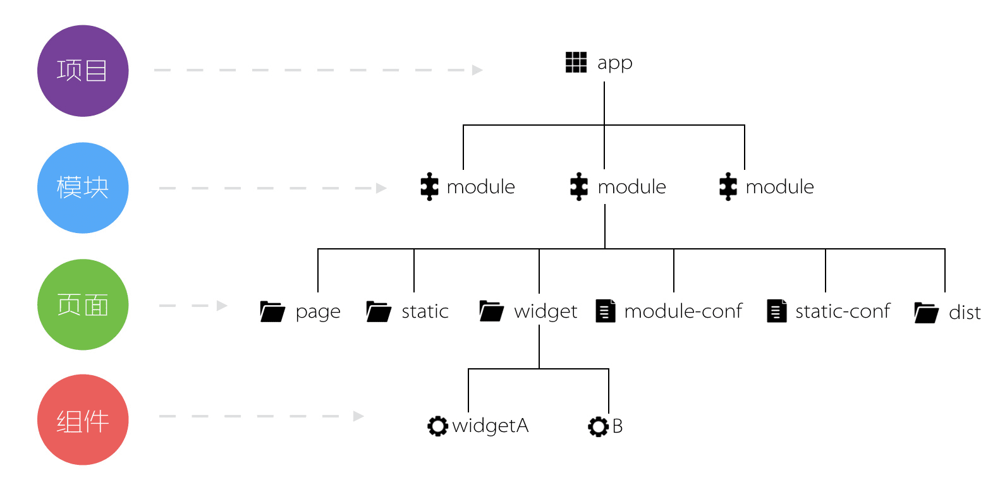
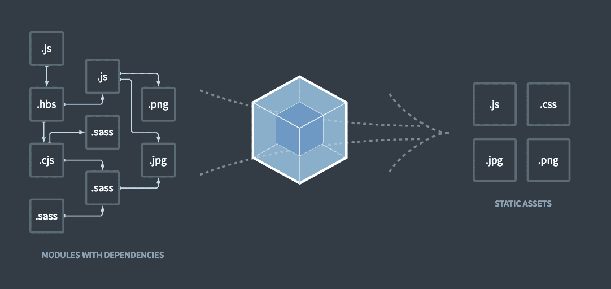
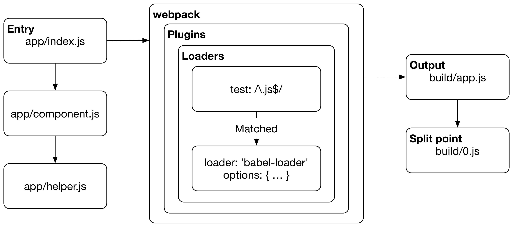
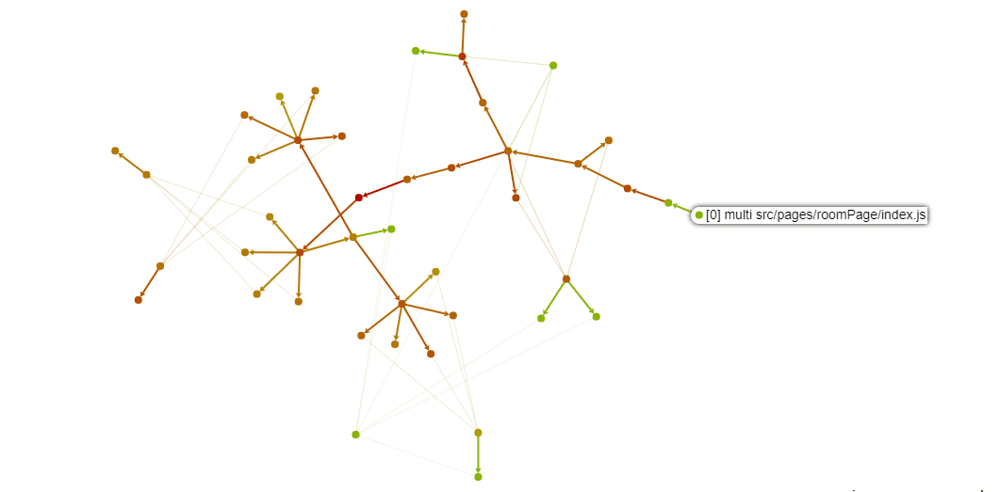
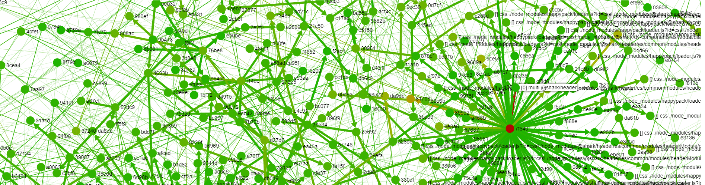
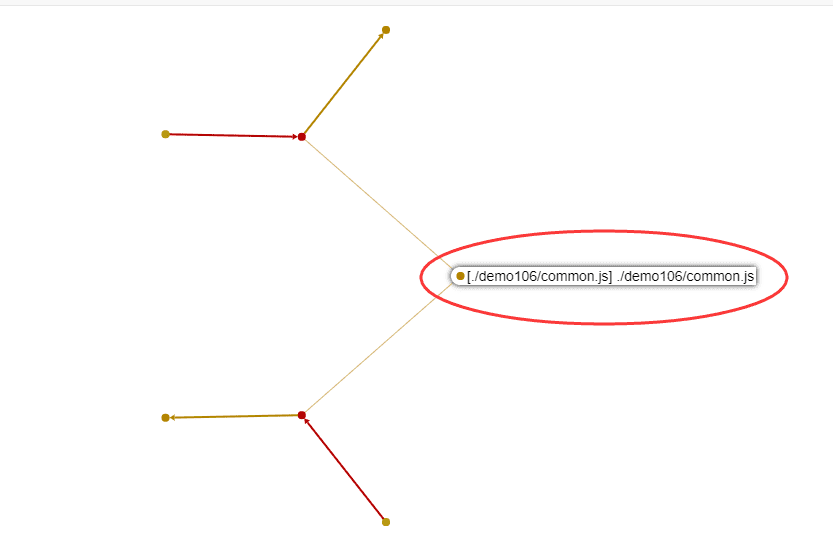
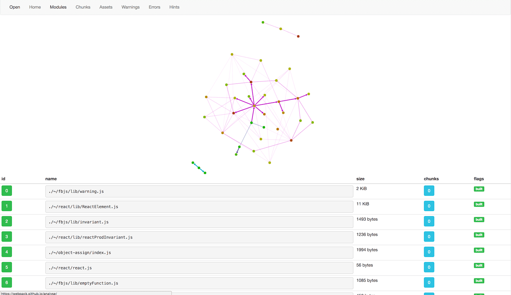
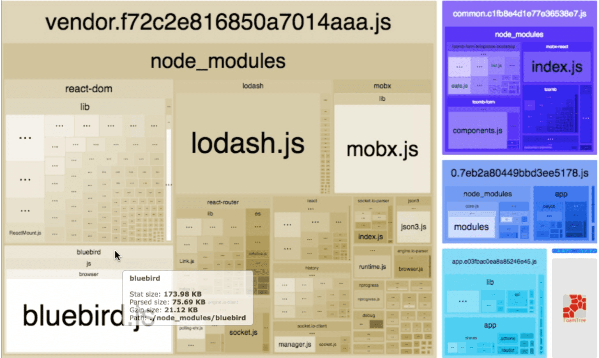

# 深入浅谈 webpack

> 这篇文章是最近两周在公司做的前端工程化系列课程的一部分，删除了部分不适合公开的内容。同时作为一个思维跳跃的沙雕讲师，特地准备了 OPML 版的[分享提纲](./深入浅谈webpack.opml)，主流的脑图软件应该都能打开。至于为什么叫这个标题，大概是因为深入和浅谈更搭哦~

# 概述

## 课程定位

- 介绍前端工程化的主要内容
- 介绍 webpack 是什么，解密 **webpackBootstrap** 原理
- 介绍 loader 和 plugin 是什么，以及如何编写
- 介绍构建过程中的常见优化方法

## 工程化解决哪些问题

都说前端其实是个特别苦逼的职业，学校里没有专门的课程，但是新技术、新技巧却在不断地被发明出来。回顾十年前的前端开发，HTML、CSS、JavaScript 三剑客，加个 jQuery 就能走天下。如果说那时候是田园时代，那如今随着各种层出不穷的大神级文明(新框架、新语言)， Web 应用日益复杂，前端开发也发生了翻天覆地的变化。


以前我们用编码就能解决问题，后来复杂到我们需要考虑架构设计。再到后来，当系统规模更大，光靠一个人，是没办法完成的，如何保证开发人员之间能互相能够配合好？如何保证项新人能迅速接手开发？我们需要考虑**前后端解耦、模块化、质量保证、代码风格**等等，于是工程化应运而生。

## 工程化包括哪些内容

### 规范化

当团队不断扩充时，我们需要制定统一的规范来对平时的开发工作做出一定约束和指导。统一的规范包括前端的代码规范，根据规范定义好一套代码检查的规则，在代码提交的时候进行检查，让开发人员知道自己的代码情况。这其中主要有：

- 目录结构制定、文档规范

  

- 编码规范 [ESLint](https://eslint.org/)、[StyleLint](https://stylelint.io/)
- Git 分支管理、Commit 描述规范
- Code Review

### 组件化

首先，组件化 ≠ 模块化。模块化只是在文件层面上，对代码或资源的拆分；而组件化是在设计层面上，对 UI 的拆分。包括完整的模版、样式和业务逻辑。

### 模块化

模块化通过将一个大文件拆分成相互依赖的小文件，再进行统一的拼装和加载。也正是模块化的实现，才使多人协作成为可能。在 ES6 之前，JavaScript 一直没有模块系统，因此社区制定了各种模块加载方案。比如：命名空间、AMD、CommonJS、UMD 等。

### 自动化

工程化的最终目标是部署上线，前端代码的运行环境为浏览器。由于原生的 HTML、CSS、JavaScript 效率并不高，于是出现了模版引擎、PostCSS、LESS、SASS、Flow/TypeScript 等中间型语言用于转义为原生的语言(包括 ES6)，所以构建过程中我们需要在合适的时机对其进行转义。再者，在开发过程中，开发者希望在编码时，能够立马在浏览器中反应出变化，这又要求了自动刷新。同时在开发中，还面临过着依赖管理，性能优化等方面的问题。于是我们会考虑将下面这些工作，实现为自动化处理：

- 自动构建
- 自动发布
- 自动测试
- 雪碧图自动合并
- SVG 自动合并
- WebP 图片自动转换
- WebP 样式自动生成
- 样式文件自动合并
- 模版片段自动生成
- 开发环境自动热加载

# webpack 是什么

> webpack 是一个打包模块化 JavaScript 的工具，在 webpack 里一切文件皆模块，通过 loader 转换文件，通过 plugin 注入钩子，最后输出由多个模块组合成的文件。Webpack 专注于构建模块化项目。



上图所体现的就是打包的功能，它能解决模块间相互依赖的问题，把乱成一锅粥的文件打包成清晰的文件，快刀斩乱麻！

## 举个栗子

webpack 对 JavaScript 提供开箱即用的支持，并且按照约定优于配置的理念，提供“0”配置的打包体验。让我们可以很快速的创建一个项目，并完成打包：

```bash
mkdir -p demo100/src && cd demo100
npm init -y
npm i webpack webpack-cli
echo "export default 42;" > src/answer.js
echo "import answer from './answer';\n" > src/index.js
echo "console.log('The answer to life the universe and everything is', answer);" >> src/index.js
```

使用 `npx webpack` 按默认配置进行构建，不出意外话即可在 `dist` 目录看到 `main.js` 文件。将其拷贝至浏览器的 `console` 或者直接在 Node.js 环境下运行 `node dist/main.js` 即可看到输出：

```
The answer to life the universe and everything is 42
```


## 执行流程

webpack 将所有文件视为模块，执行时需要指定入口(entry)和输出(output)。构建程序从用户定义的入口模块开始，递归的拿到所有模块，构成依赖图(dependency graph)，然后将所有这些依赖输出成一个或多个 chunk。简单流程如下：



完整流程，可参考淘宝前端团队整理的这张 [webpack 整体流程图](https://img.alicdn.com/tps/TB1GVGFNXXXXXaTapXXXXXXXXXX-4436-4244.jpg)，其中主要流程包括：

1. 初始化参数：从配置文件和 shell 语句中读取与合并参数，得出最终的参数；
1. 开始编译：用上一步得到的参数初始化 compiler 对象，加载所有配置的插件，执行对象的 run 方法开始执行编译；
1. 确定入口：根据配置中的 entry 找出所有的入口文件；
1. 编译模块：从入口文件出发，调用所有配置的 loader 对模块进行翻译，再找出该模块依赖的模块，再递归本步骤直到所有入口依赖的文件都经过了本步骤的处理；
1. 完成模块编译：在经过第 4 步使用 loader 翻译完所有模块后，得到了每个模块被翻译后的最终内容以及它们之间的依赖关系；
1. 输出资源：根据入口和模块之间的依赖关系，组装成一个个包含多个模块的 chunk，再把每个 chunk 转换成一个单独的文件加入到输出列表，这步是可以修改输出内容的最后机会；
1. 输出完成：在确定好输出内容后，根据配置确定输出的路径和文件名，把文件内容写入到文件系统。

> 如何构建依赖图？

webpack 在处理文件之前，会将文件按对应的配置规则交给 loader 处理。拿到 loader 处理后的文件，使用 [acorn](https://github.com/acornjs/acorn/tree/master/acorn) 生成 [AST](https://en.wikipedia.org/wiki/Abstract_syntax_tree) 并进行遍历，当遇到 `require` 和 `import` 等引用时，对其引用的路径，按配置规则进行 `resolve` 以后作为依赖模块进行处理。

- 你以为的依赖图

  

- 真实的依赖图

  

> 循环依赖怎么办？

遵循 CommonJS 的处理方式，拿到一个**未完成的拷贝**([unfinished copy](http://nodejs.cn/api/modules.html#modules_cycles))。

> 常见错误

```
Error: Cannot find module '/path/to/somewhere/manifest.json'
    at Function.Module._resolveFilename (module.js:538:15)
    at Function.Module._load (module.js:468:25)
    at Module.require (module.js:587:17)
    at require (internal/module.js:11:18)
    at _default (/path/to/somewhere/webpack.config.js:56:17)

ERROR in ./src/index.js 5:0
Module parse failed: Unexpected character '@' (5:0)
You may need an appropriate loader to handle this file type.
| console.log('The answer to life, the universe and everything is', answer);
|
> @answer
| class A {}
|

ERROR in ./src/index.js
Module not found: Error: Can't resolve './no-exist' in '/path/to/somewhere/src'
 @ ./src/index.js 1:0-34 3:66-72
```

## 核心概念

webpack 是一个基于配置的驱动的构建工具，由 4 部分核心内容组成：

- entry

  指定入口。

- output

  输出配置。

- loader

  loader 提供文件(模块)层面的操作。前端除了 JavaScript，还有资源文件，这里所说的资源，是除了 JavaScript 以外的所有文件，包括 CSS 样式文件、图片文件、模版文件等等。
  webpack 本身只支持 JavaScript，而 **loader 能够让 webpack 处理那些非 JavaScript 文件，并且先将它们转换为有效模块，然后添加到依赖图中**。

  以处理 [PNG](https://www.filesignatures.net/index.php?page=search&search=PNG&mode=EXT) 图片为例：

  ```js
  // 原始模块内部引用 demo.png 图片
  import demo from './demo.png';

  // demo.png 原始内容
  <Buffer 89 50 4e 47 0d 0a 1a 0a 00 00 00 0d ... >

  // file-loader 将二进制图片转换成类似如下文本文件返回
  export default 'dist/assets/demo.png';
  ```

- plugin

  plugin 借助 webpack 设计的 [tapable](https://github.com/webpack/tapable) 机制，可以在更广的范围提供接触并修改构建产物的机会。从而实现诸如：打包优化、资源管理和注入环境变量等工作。

  > webpack 的核心功能是抽离成很多个[内部插件](https://github.com/webpack/webpack/blob/master/lib/WebpackOptionsApply.js#L309)来实现的。

## webpackBootstrap 原理介绍

通过上面简单的步骤，我们便实现了将 `answer.js` 和 `index.js` 打包到一起的目的。观察上面输出的 `main.js` 可以看到，除了我们写的 3 行代码，还有大量 webpack 注入的代码。这些代码就是所谓的 webpackBootstrap，也就是 webpack 对于模块化的实现方式。也正是基于 webpackBootstrap 使得我们可以把不同模块打包到一起并且保证互不会影响。下面就让我们一切看一下 webpackBootstrap 是怎样实现这一切的。

> 以下代码片段，使用 `index.js` 作为 entry 进行构建，运行时是否会抛错？

```js
// counter.js
var counter = window.counter || { t: 0 };
window.counter = counter;
if (counter.t > 0) throw new Error();
export default counter;

// A.js
import counter from './counter.js';
counter.t++;
console.log('in A:', counter.t);

// B.js
import counter from './counter.js';
counter.t++;
console.log('in B:', counter.t);

// index.js
import './A';
import './B';
```

> 该部分正文参照 [详解 webpackBootstrap](./详解webpackBootstrap.md)。

# webpack 高级用法

## 编写 loader

loader 的本质是一个模块转换方法，一个最简单的 loader 源码如下：

```js
module.exports = function(content) {
  return '';
};
```

### 常用工具

- loader-runner

  [loader-runner](https://github.com/webpack/loader-runner) 提供一个不需要启动 webpack 独立运行 loader 的环境。

- loader-utils

  [loader-utils](https://github.com/webpack/loader-utils) 提供一些和 webpack 配置对应的工具方法，常用到的比如 `getOptions`、`parseQuery`、`interpolateName` 和 `getHashDigest` 等。

### 撸个处理图片的 loader

实现思路，通过 loader 将图片转为 base64 编码的字符串，拼接成 [Data URLs](https://developer.mozilla.org/zh-CN/docs/Web/HTTP/data_URIs) 输出。

> ```
> data:[<mediatype>][;base64],<data>
> ```

核心代码 [img-loader.js](../codes/webpack-magic/demo102/loaders/img-loader.js)：

```js
module.exports = function(content) {
  const type = getType(this.resourcePath);
  const data = content.toString('base64');

  return `export default ${JSON.stringify(`data:${type};base64,${data}`)}`;
};
```

[webpack](../codes/webpack-magic/demo102/webpack.config.js) 对应配置：

```diff
  optimization: {
    runtimeChunk: 'single', // 抽离 rumtime 到单独文件
  },
+ module: {
+   rules: [
+     {
+       test: /\.png$/i,
+       use: [
+         // resolve(__dirname, 'loaders/ignore-loader.js'),
+         resolve(__dirname, 'loaders/img-loader.js'),
+       ],
+     },
+   ],
+ },
  plugins: [new HtmlWebpackPlugin({ title: 'webpack demo' })],
```

## 编写 plugin

plugin 借助 webpack 的 [tapable](https://github.com/webpack/tapable) 机制，使得其能够 hook 住编译中触发的所有关键事件。在编译的每一步，插件都具备完全访问 compiler 对象的能力，在某些事件点时还可以访问当前 compilation 对象。

> compiler 和 compilation 的区别？

compiler 对象包含了 webpack 环境所有的的配置信息，包含 options、loaders、plugins，可以简单地把它理解为 webpack 实例；而 compilation 对象包含了当前的模块资源、构建生成资源、变化的文件等。

> tapable 是什么？

webpack 本质上是一种事件流的机制，它的工作流程就是将各个插件串联起来，而实现这一切的核心就是 tapable。它和 Node.js 中的 EventEmitter 类似，都是注册监听，然后收发事件。webpack 提供了一些常用的 **hooks**，他们均继承自 tapable。在这些 hooks 之上，通过 `tap` `tapPromise` `tapAsync` 等方法**注册**事件。事件的触发由 webpack 统一管理，通过 `call` `promise` `callAsync` 等方法触发。

SyncHook 的伪代码：

```js
class SyncHook {
  constructor() {
    this.hooks = [];
  }
  tap(name, fn) {
    this.hooks.push(fn);
  }
  call(...args) {
    this.hooks.forEach(hook => hook(...args));
  }
}
```

一个最简单的 plugin 源码如下：

```js
module.exports = class DemoPlugin {
  constructor(options) {
    this.options = options;
  }
  apply(compiler) {
    compiler.hooks.done.tap('DemoPlugin', () => {
      console.log('Job done!');
    });
  }
};
```

### 比较重要的 hooks

webpack 初始化时会实例化所有传入的 plugin 调用它们的 `apply` 方法并把 `compiler` 对象传入。通过 `compiler` 对象暴露的 API ，我们就可以使用 webpack 整个流程暴露的[所有 hooks](https://webpack.docschina.org/api/compiler-hooks)。一些关键的 hooks，可以对照这张[webpack 流程图](https://lxzjj.github.io/2017/11/02/%E7%8E%A9%E8%BD%ACwebpack%EF%BC%88%E4%B8%80%EF%BC%89/webpack%E6%B5%81%E7%A8%8B%E5%9B%BE.svg)。

```js
compiler.hooks.someHook.tap(/* ... */);
// compiler.plugin('someHook', /* ... */)
```

- compiler 上比较重要的 hooks：

  - `thisCompilation` 触发 compilation 事件之前，常用来添加额外的依赖等，从这里开始注册方法的入参变为 `compilation` 对象
  - `make` `compilation` 对象准备完毕，开始构建之前，从这里开始触发 `compilation` 上的 hooks
  - `emit` 生成资源到 output 目录之前，常用来删除中间资源或新增其他资源等
  - `done` 编译 compilation 完成，常用来构建模版或者输出分析等，这一步注册方法的入参为 `stats` 对象
  - `failed` 编译 compilation 失败，常用来收集上报错误信息等，这一步注册方法的入参为 `error` 对象

- compilation 上比较重要的 hook：

  - `buildModule` 模块开始构建之前
  - `succeedModule` 模块构建成功
  - `finishModules` 所有模块都完成构建
  - `seal` 编译停止接收新模块时触发
  - `additionalAssets` 为编译 compilation 创建附加资源，常用来添加额外资源等
  - `optimizeChunkAssets` 优化所有 chunk 资源，常用来代码压缩等

### 撸一个自动应用外部扩展的 plugin

所谓外部扩展([externals](https://webpack.docschina.org/configuration/externals/))，就是让 webpack 不把某些包打包进 chunk 内部，而是在运行时从外部获取这些扩展依赖。

要实现这一功能，需要两步。首选，在 webpack 开始处理 entry 之前，**修改配置**对需要应用外部扩展的库添加 `externals` 配置；其次，在编译完成后在模版文件内部加入外部扩展库的 CDN 引用。

核心代码 [AutoCDNPlugin.js](../codes/webpack-magic/demo103/plugins/AutoCDNPlugin.js)：

```js
compiler.hooks.done.tap('AutoCDNPlugin', stats => {
  compiler.hooks.environment.tap('AutoCDNPlugin', () => {
    /* ... */
    const { externals } = compiler.options;

    compiler.options.externals = Object.assign({}, externals, cdnModules);
  });

  compiler.hooks.done.tap('AutoCDNPlugin', stats => {
    /* ... */
    const html = assets[htmlFile]
      .source()
      .replace(/<head>([\s\S]*?)<\/head>/, (match, p) =>
        match.replace(p, p + links.join('\n'))
      );

    writeFileSync(resolve(path, htmlFile), html, 'utf-8');
  });
});
```

## 常用优化方法

### 使用 DllPlugin

用过 Windows 系统的人应该会经常看到以 `.dll` 为后缀的文件，这些文件称为动态链接库，在一个动态链接库中可以包含给其他模块调用的函数和数据。要给 Web 项目构建接入动态链接库的思想，需要完成以下事情：

- 把网页依赖的基础模块抽离出来，打包到一个个单独的动态链接库中去。一个动态链接库中可以包含多个模块
- **当需要导入的模块存在于某个动态链接库中时，这个模块不能被再次被打包，而是去动态链接库中获取**
- 页面依赖的所有动态链接库需要被加载

webpack 通过 `webpack.DllPlugin` 结合 `webpack.DllReferencePlugin` 实现该功能。示例参考 [demo104](../codes/webpack-magic/demo104)，核心代码：

- `vendor.js`

  ```js
  var vendor_2d4c95b = (function(modules) {
    /* ... */

    return __webpack_require__((__webpack_require__.s = 0));
  })({
    [id]: ƒ,
    0: function(module, exports, __webpack_require__) {
      module.exports = __webpack_require__;
    },
  });
  ```

- `manifest.json`

  ```json
  {
    "name": "vendor_2d4c95b",
    "content": {
      "./node_modules/react/index.js": {
        "id": "./node_modules/react/index.js",
        "buildMeta": { "providedExports": true }
      }
    }
  }
  ```

- `demo104.dll.js`

  ```js
  window['webpackJsonp'].push([], {
    './node_modules/react/index.js': function(
      module,
      exports,
      __webpack_require__
    ) {
      module.exports = __webpack_require__('dll-reference vendor_2d4c95b')(
        './node_modules/react/index.js'
      );
    },
    'dll-reference vendor_2d4c95b': function(module, exports) {
      module.exports = vendor_2d4c95b;
    },
  });
  ```

### 按需加载

```js
function sayHello() {
  import('./sayHello.js').then(module => {
    module.default.sayHello();
  });
}
```

当代码执行到 `import` 所在语句时才会去加载由 chunk 对应生成的文件，`import` 返回一个 Promise，当文件加载成功时可以在 Promise 的 `then` 方法中获取到对应 chunk。

> babel 默认不支持 `import()` 语法（依赖 [@babel/plugin-syntax-dynamic-import](https://babeljs.io/docs/en/next/babel-plugin-syntax-dynamic-import.html) 提供支持），但是 webpack 支持。

#### 加载原理

示例参考 [demo107](../codes/webpack-magic/demo107)，核心代码：

<!-- prettier-ignore -->
```js
/******/ 	// install a JSONP callback for chunk loading
/******/ 	function webpackJsonpCallback(data) {
/******/ 		var chunkIds = data[0];
/******/ 		var moreModules = data[1];
/******/ 		var executeModules = data[2];
/******/
/******/ 		// add "moreModules" to the modules object,
/******/ 		// then flag all "chunkIds" as loaded and fire callback
/******/ 		var moduleId, chunkId, i = 0, resolves = [];
/******/ 		for(;i < chunkIds.length; i++) {
/******/ 			chunkId = chunkIds[i];
/******/ 			if(installedChunks[chunkId]) {
/******/ 				resolves.push(installedChunks[chunkId][0]);
/******/ 			}
/******/ 			installedChunks[chunkId] = 0;
/******/ 		}

/******/ 		while(resolves.length) {
/******/ 			resolves.shift()();
/******/ 		}
```

### 提取公共代码

提取公共代码主要依赖于 [SplitChunksPlugin](https://webpack.js.org/plugins/split-chunks-plugin/)。



示例参考 [demo106](../codes/webpack-magic/demo106)：

```diff
  optimization: {
    runtimeChunk: 'single', // 抽离 rumtime 到单独文件
+   splitChunks: {
+     cacheGroups: {
+       common: {
+         name: 'common',
+         chunks: 'all',
+         minSize: 0,
+         minChunks: 2,
+       },
+     },
+   },
  },
  plugins: [new HtmlWebpackPlugin({ title: 'webpack demo' })],
```

> 构建出来的 common 模块和 moduleA moduleB 模块有什么区别？

### 输出分析

- [Webpack Analyse](http://webpack.github.io/analyse/)

  

- [webpack-bundle-analyzer](https://github.com/webpack-contrib/webpack-bundle-analyzer)

  

- [Webpack Visualizer](https://github.com/chrisbateman/webpack-visualizer)
- [Webpack Chart](https://github.com/alexkuz/webpack-chart)
- [Stellar Webpack](https://github.com/alexkuz/stellar-webpack)

### 缓存及并发

在整个 webpack 构建流程中，loader 对文件的转换和代码压缩是最耗时的过程，前者需要处理大量数据（模块），后者需要抽象成 AST 然后应用各种规则分析和处理，整个过程计算量巨大。文件读写和计算操作是无法避免的，那能不能让 webpack 同一时刻处理多个任务，发挥多核 CPU 电脑的威力，以提升构建速度呢？

> 由于 JavaScript 是单线程模型，要想发挥多核 CPU 的能力，只能通过多进程去实现，而无法通过多线程实现。

- [HappyPack](https://github.com/amireh/happypack)
- [ParallelUglifyPlugin](https://github.com/gdborton/webpack-parallel-uglify-plugin)

## 实际案例

### common 代码额外分组

```js
function getJsGroups(entries) {
  /* ... */

  return {
    common: {
      name: 'common',
      minChunks: 2,
      priority: 10,
      chunks: 'all',
      // extract all css in common-pre and put it in the header so when some
      // dynamic chunk need the common.css it won't load again
      test: (module, chunks) =>
        module.type !== 'css/mini-extract' &&
        !chunks.some(chunk => preGroup.includes(chunk.name)),
    },
    'common-pre': {
      name: 'common-pre',
      minChunks: 2,
      priority: 1,
      chunks: 'all',
    },
  };
}
```

### 合并样式文件

```js
compiler.hooks.emit.tap('CombineCssPlugin', compilation => {
  const { entry, appendRule } = this.options;
  const { chunks, assets } = compilation;

  /* ... */

  Object.entries(cssFiles).forEach(([group, files]) => {
    /* ... */

    const content = files
      .map(file => (assets[file].source && assets[file].source()) || '')
      .join('\n');

    if (content.length > 400 * 1024) {
      logger.yellow(`cssGroup [${group}] 大于 400KB 请注意合理分组!!!`);
    }

    const hash = createHash('md5')
      .update(content)
      .digest('hex')
      .slice(0, 7);

    const newFile = `${relativeDist}/${group}_${hash}.css`;

    assets[newFile] = new RawSource(content);

    // delete used, needn't emit this source
    files.forEach(file => {
      logger.green(`deleting ${file}, which has been merged in ${newFile}...`);

      delete assets[file];
    });
  });
});
```

# 小结

通过此次课程希望各位对 webpack 的构建流程以及构建代码的执行流程能有一个初步的了解。此次课程更多是把 webpack 的各个点拆开了给大家介绍，如果各位能从一到两个点上获得启发，那我认为就是物有所值的。webpack 的终极威力是要把这些零碎的点组织成一个完整的配置，这样才能体现它的效率。这方面的介绍，还请大家持续关注后续课程(never exists)。

# 扩展阅读

- [一个前端的自我修养](http://taobaofed.org/blog/2016/03/23/the-growth-of-front-end/)
- [我为什么这么强调前端工程化](https://segmentfault.com/a/1190000007414499)
- [webpack 官网](https://webpack.js.org/)
- [深入浅出 webpack](http://webpack.wuhaolin.cn/)
- [webpack Book](https://survivejs.com/webpack/introduction/)
- [详解 webpackBootstrap](https://github.com/Rainsho/blog/blob/master/articles/%E8%AF%A6%E8%A7%A3webpackBootstrap.md)
- [webpack 4.X 从入门到精通](https://cloud.tencent.com/info/d6ca7c72f3389de6f073ff3afc7dcc0a.html)
- [细说 webpack 之流程篇](http://taobaofed.org/blog/2016/09/09/webpack-flow/)
- [玩转 webpack](https://lxzjj.github.io/2017/11/02/%E7%8E%A9%E8%BD%ACwebpack%EF%BC%88%E4%B8%80%EF%BC%89/)
- [Webpack — The Confusing Parts](https://medium.com/@rajaraodv/webpack-the-confusing-parts-58712f8fcad9)
