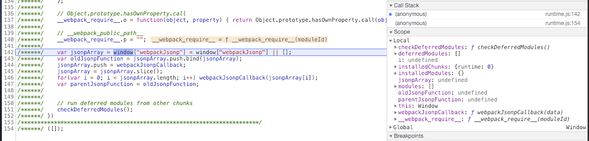
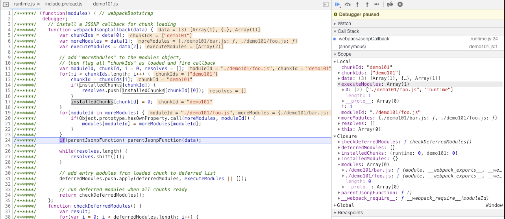
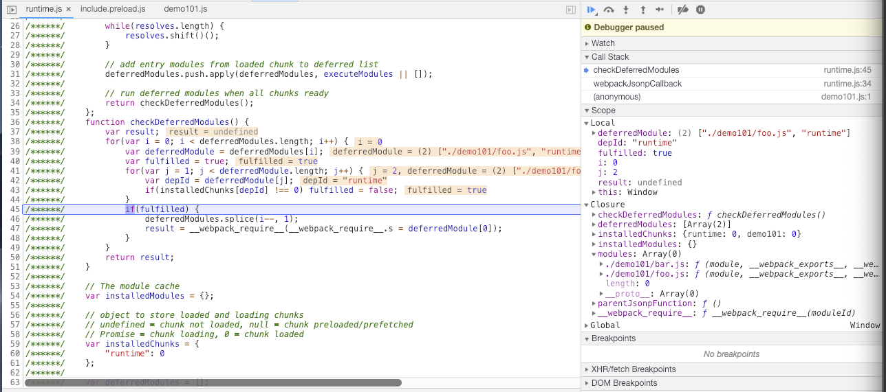
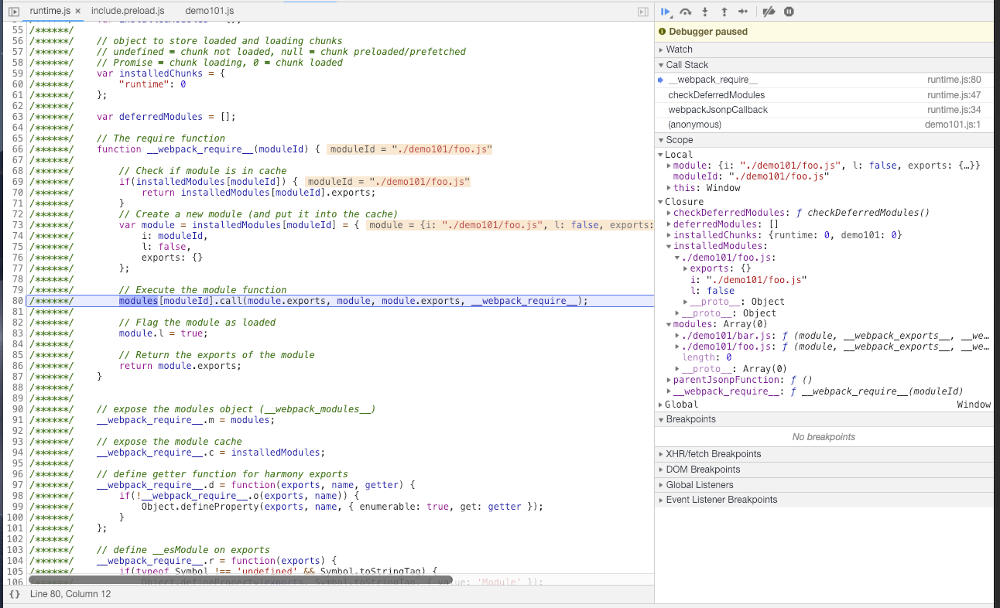
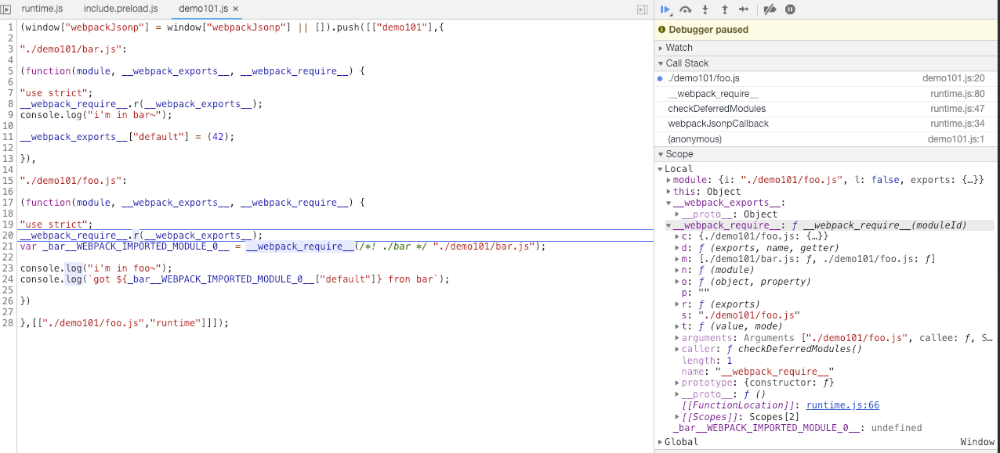
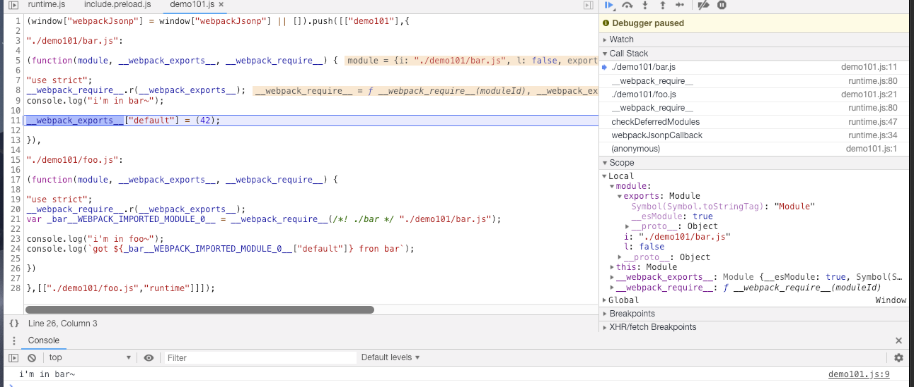

# 详解 webpackBootstrap

## 说明

1. 本文不探讨 webpack 如何配置、如何优化。
1. 本文侧重 webpack 构建后的代码(模块)如何工作，即 `import` 或 `require` 时到底发生了什么。
1. 本文主要探究 webpack `rumtime` (即 `webpackBootstrap`) 的完整调用栈。

## TL;DR

1. webpack 将模块封装成函数，以 `{[id]: ƒ}` 形式记录。
1. `rumtime` 是一个大的自执行函数，入参 `modules` 是一个集合。
1. 初始化时，通过闭包方法 `webpackJsonpCallback`，将模块 `{[id]: ƒ}` 添加进 `modules`。
1. `require` 时通过将闭包方法 `__webpack_require__` 作为入参传入模块 `ƒ` 使得模块可以访问到 `rumtime` 闭包作用域下的其他模块。
1. `__webpack_require__` 将模块 `ƒ` 执行完后 `exports` 的结果放入闭包的 `installedModules` 内，下次 `require` 时直接返回。

## 简单交代背景

手上的一个项目使用 `DllPlugin` 拆分 `bundles`，每次会单独构建所谓的 DLL。该部分代码主要是一些主流的第三方库诸如 React Redux 等，同时也包含部分自研的工具库。通常都是单独构建后通过 `DllReferencePlugin` 暴露给业务代码引用。DLL 的优势和好处有兴趣的同学可自行参考[官网](https://webpack.js.org/plugins/dll-plugin/)，简单来讲通过这样的构建设计可以大幅度降低构建时间，同时 DLL 文件也可以长时间进行 CDN 缓存。

前些日子遇到这样一个优化场景，业务方希望使用 DLL 中的一小部分包(简称 A 包)，开发一个优先加载的模块 P。正常情况下只需要在 P 项目中单独引用 A 包然后正常构建即可。**但是**，不巧的是，该 A 包是进行部分初始化工作的模块，而该优先加载的模块，我们的设计目标是渐进式上线。即在正常情况下 A 包初始化的功能在业务模块内部进行，而在优化场景下需 A 包在该优先加载的(P 项目输出)模块内进行初始化操作。(balabala...，背景越写越长，但不是这次的重点，顺便提一下这个场景的实现方式就是适当的共享不同构建项目的 `rumtime`，至于为什么会可行，了解下 `rumtime` 做了什么就行了)。

## 准备环境

webpack 4 的 `rumtime` 较 webpack 3 做了很多优化，最明显的一点就是 `checkDeferredModules` 功能，会等待所有依赖的 module 加载完毕后再开始执行代码，因此不需要强行约束 chunk 代码的加载顺序。这里我们使用 webpack 4 进行示例和解读。详细代码可参见 [webpack-magic](../codes/webpack-magic)。

- 业务代码

  [./demo101/bar.js](../codes/webpack-magic/demo101/bar.js)

  ```js
  console.log("i'm in bar~");

  export default 42;
  ```

  [./demo101/foo.js](../codes/webpack-magic/demo101/foo.js)

  ```js
  import bar from './bar';

  console.log("i'm in foo~");
  console.log(`got ${bar} fron bar`);
  ```

- webpack 配置

  [./demo101/webpack.config.js](../codes/webpack-magic/demo101/webpack.config.js)

  ```js
  const { resolve } = require('path');
  const HtmlWebpackPlugin = require('html-webpack-plugin');

  module.exports = {
    mode: 'development',
    entry: { demo101: resolve(__dirname, 'foo.js') },
    output: {
      path: resolve(__dirname, '../dist'),
      filename: '[name].js',
    },
    devtool: false, // 关闭 source-map 方便阅读构建直出的代码
    optimization: {
      runtimeChunk: 'single', // 抽离 rumtime 到单独文件
    },
    plugins: [new HtmlWebpackPlugin({ title: 'demo101' })],
  };
  ```

- 执行编译

  ```bash
  cd webpack-magic
  npm i
  npm run wb101
  ```

不出意外的话即可在 `dist` 目录下看到输出的 `demo101.js` `index.html` 和 `runtime.js`。

## 初窥 runtime

> Tips: 注意区分 chunk <-> chunks & module <-> modules

### 整体

- 一个 153 行的自执行函数 IIFE，入参 `modules` === `[]`
- 闭包函数 `webpackJsonpCallback`
- 闭包函数 `checkDeferredModules`
- 闭包变量 `installedModules` `installedChunks` `deferredModules`
- 闭包函数 `__webpack_require__`
- `__webpack_require__` 的一些扩展
- 业务代码
  - 闭包变量 `jsonpArray` `oldJsonpFunction` `parentJsonpFunction`

接下来我们从下往上，看各个部分。

### 业务代码

<!-- prettier-ignore -->
```js
var jsonpArray = window["webpackJsonp"] = window["webpackJsonp"] || [];
var oldJsonpFunction = jsonpArray.push.bind(jsonpArray);
jsonpArray.push = webpackJsonpCallback;
jsonpArray = jsonpArray.slice();
for (var i = 0; i < jsonpArray.length; i++) webpackJsonpCallback(jsonpArray[i]);
var parentJsonpFunction = oldJsonpFunction;

// run deferred modules from other chunks
checkDeferredModules();
```

这一段首先检查了 window 下有无之前定义的 `jsonpArray`，若无则定义为一个空集合。同时将 `jsonpArray` 的 `push` 方法作为 `oldJsonpFunction` 同时指定其上下文 `this::window["webpackJsonp"]` 为自己。接着使用闭包的 `webpackJsonpCallback` 覆盖其 `push` 方法(此时同时覆盖了 `window["webpackJsonp"]` 的 `push` 方法，但 `oldJsonpFunction` 指向原生的 `push` 方法)。

接下来 `jsonpArray = jsonpArray.slice();` 这一行比较重要！调用了原生的 `slice` 方法，使得 `jsonpArray` 变成一个普通的 Array。此时 `jsonpArray.push === Array.prototype.push` 而之前暴露在 window 下的 `window["webpackJsonp"] === webpackJsonpCallback`。

接着往后，依次对 `jsonpArray` 内的对象调用 `webpackJsonpCallback`，然后用闭包的 `parentJsonpFunction` 指向之前的 `oldJsonpFunction`，最后执行 `checkDeferredModules`。

在 `runtime` 自执行时，我们讲到了入参 `modules` === `[]`，所以初始化时 `webpackJsonpCallback` 实际不会被执行，因此我们先看 `checkDeferredModules`。

### 闭包函数 `checkDeferredModules`

<!-- prettier-ignore -->
```js
function checkDeferredModules() {
  var result;
  for(var i = 0; i < deferredModules.length; i++) {
    var deferredModule = deferredModules[i];
    var fulfilled = true;
    for(var j = 1; j < deferredModule.length; j++) {
      var depId = deferredModule[j];
      if(installedChunks[depId] !== 0) fulfilled = false;
    }
    if(fulfilled) {
      deferredModules.splice(i--, 1);
      result = __webpack_require__(__webpack_require__.s = deferredModule[0]);
    }
  }
  return result;
}
```

`checkDeferredModules` 并没有入参，因此它能取到的值都是当前 `runtime` 内闭包的变量。它做的事情也很简单，即对闭包集合 `deferredModules` 内的所有 modules 进行遍历，如果其满足 `fulfilled` 条件(即任意 module 依赖的所有 chunks 都已经在 `installedChunks` 内，注意检查是从 `j = 1` 开始的)，则将其从 `deferredModules` 删除，使用 `__webpack_require__` 调用该 module 内的 `j = 0` 对应的模块(即入口模块)。

### 闭包函数 `webpackJsonpCallback`

<!-- prettier-ignore -->
```js
function webpackJsonpCallback(data) {
  var chunkIds = data[0];
  var moreModules = data[1];
  var executeModules = data[2];

  // add "moreModules" to the modules object,
  // then flag all "chunkIds" as loaded and fire callback
  var moduleId, chunkId, i = 0, resolves = [];
  for(;i < chunkIds.length; i++) {
    chunkId = chunkIds[i];
    if(installedChunks[chunkId]) {
      resolves.push(installedChunks[chunkId][0]);
    }
    installedChunks[chunkId] = 0;
  }
  for(moduleId in moreModules) {
    if(Object.prototype.hasOwnProperty.call(moreModules, moduleId)) {
      modules[moduleId] = moreModules[moduleId];
    }
  }
  if(parentJsonpFunction) parentJsonpFunction(data);

  while(resolves.length) {
    resolves.shift()();
  }

  // add entry modules from loaded chunk to deferred list
  deferredModules.push.apply(deferredModules, executeModules || []);

  // run deferred modules when all chunks ready
  return checkDeferredModules();
}
```

回头再看 `webpackJsonpCallback`，它的入参是一个有 3 个对象的集合。第一个是当前 chunk 的 IDs (通常为单个)，类型为 `Array<string>`；第二个是当前 chunk 包含的模块，类型为 `{[string]: function}`；第三个则是该 chunk 的执行依赖 chunks，类型为 `Array<Array<string>>`。前两个参数无需多说，第三个参数是 webpack 4 新引入的，其作用就是交给前面提到的 `checkDeferredModules` 去检查 module 是否具备执行条件 `fulfilled`。

> Tips: 这里的第一和第三入参之所以是 `Array` 实际上对应的是多入口的情况 `chunkIds: Array<string>(n)` 和 `executeModules： Array<Array<string>>(n)`，原则上讲两个 n 应该是相等的。还有一点就是 `executeModules` 的准确类型应该是 `[[moduleId, ...chunkIds]]`，`moduleId` 是该模块的入坑，对应上方 `j = 0` 的情况，而 `chunkIds` 才是该模块能够执行的条件。

`webpackJsonpCallback` 的内部，首先遍历当前 chunk 的 `chunkIds`，将其在 `installedChunks` 内的状态标识为 0；如果标识之前其已经在 `installedChunks` 内，则将其放入 `resolves` 集合内。接下来遍历该 chunk 所包含的所有模块，将其放在 `modules` 内对应的位置上。**注意**，这里的 `modules` 是 `runtime` 自执行函数的入参，即那个空集合。接着用入参，调用当前 `runtime` 的 `parentJsonpFunction` 方法；然后遍历 `resolves` 集合让其自执行(这两部分主要是有多个 `runtime` 时才会有影响，主要还是为了让之前的模块有机会拿到依赖的 chunks 从而触发执行，后面再详细分析)。最后，当前 chunk 安装完毕，将当前 chunk 依赖的 chunks 放入 `deferredModules`，检查是否具备执行条件 `checkDeferredModules()`。

`webpackJsonpCallback` 的运行过程其实就是将当前 chunk 的模块添加到 `modules` 内，并没有**执行**。执行前 `modules` 类似 `[]`，执行后变为 `[ƒ, ƒ, ƒ, ƒ, ƒ]`，而其中的每一个 `ƒ` 正是所谓的模块。

### 闭包函数 `__webpack_require__`

webpack 的核心 magic 应该就是 `__webpack_require__` 方法。正是通过封装的 `__webpack_require__` 实现了前端的模块化。

<!-- prettier-ignore -->
```js
// The require function
function __webpack_require__(moduleId) {

  // Check if module is in cache
  if(installedModules[moduleId]) {
    return installedModules[moduleId].exports;
  }
  // Create a new module (and put it into the cache)
  var module = installedModules[moduleId] = {
    i: moduleId,
    l: false,
    exports: {}
  };

  // Execute the module function
  modules[moduleId].call(module.exports, module, module.exports, __webpack_require__);

  // Flag the module as loaded
  module.l = true;

  // Return the exports of the module
  return module.exports;
}
```

主方法很简单，无非做了下面几件事情：

1. 检查 `require` 的 `moduleId` 是否在 `installedModules` 内部，若在，则返回其 `exports` 属性。
1. 若不在，则声明一个新的 `module` 对象，并赋值在 `installedModules` 内部。
1. 从(由 `webpackJsonpCallback` 安装的) `modules` 内部找到对应模块(`ƒ`)，将当前 `module` 和 `__webpack_require__` 方法传入，调用执行。
1. 返回执行完(即已经写入)的 `exports` 属性。

> Tips: 这里有个小坑，注意第 2 步的时候，此时该 `moduleId` 已经在 `installedModules` 内部了，而 `module.exports` 还是个空对象 `{}`。当多个构建共享 `runtime` 而又相互依赖时，有可能出现：A 依赖 B，而 B 通过 C 暴露出去(类似 `DllReferencePlugin` 的情形)，这个时候 A 去 `__webpack_require__` B，实际是找的 C，而 C 去 `__webpack_require__` B 时发现 B 已经在 `installedModules` 内了，所以输出了空对象 `{}`。

### `__webpack_require__` 的一些扩展

最后便是 `__webpack_require__` 的一些扩展，主要包括两类：

- 暴露对象

  - `__webpack_require__.m`: 暴露 `modules`
  - `__webpack_require__.c`: 暴露 `installedModules`
  - `__webpack_require__.p`: 暴露 `publicPath`

- 工具类

  - `__webpack_require__.o = function(object, property)`
  - `__webpack_require__.d = function(exports, name, getter)`
  - `__webpack_require__.n = function(module)`
  - `__webpack_require__.r = function(exports)`
  - `__webpack_require__.t = function(value, mode)`

## let's debugger

`webpackBootstrap` 的代码涵盖的情景非常多，上面读完可能比较晕菜。下面结合实际例子，看一下 `runtime` 的调用栈。

### demo101

demo101 的源码已经在前面 [准备环境](#准备环境) 做了介绍。模块 `foo.js` 导入模块 `bar.js` 输出的值(42)。使用 `npm run wb101` 构建完成后，启动 HTTP 服务(个人常用 [http-server](https://github.com/indexzero/http-server))，e.g. `http-server dist -p 3000`。

- `runtime.js`

  ```diff
    /******/ (function(modules) { // webpackBootstrap
  +           debugger;
    /******/ 	// install a JSONP callback for chunk loading
    /******/ 	function webpackJsonpCallback(data) {
  ```

  访问 [http://localhost:3000/](http://localhost:3000/)，`runtime` 的执行非常简单，定义了前面讨论的闭包的方法和变量。一直按 F10 到 140 行，我们可以看到所有变量完成了初始化，以及其初始值：

  

  - `deferredModules`: `[]`
  - `installedChunks`: `{runtime: 0}`
  - `installedModules`: `{}`
  - `modules`: `[]`

  接着 142 - 147 行定义了 `window["webpackJsonp"] = []` 并覆盖其 `push` 方法为 `webpackJsonpCallback`，`jsonpArray` 通过赋值调用 `slice` 方法，使得 `webpackJsonpCallback` 仅指向 `window["webpackJsonp"].push`，至此：

  - `window["webpackJsonp"]`: `[push: ƒ]` (`push === webpackJsonpCallback`)
  - `jsonpArray`: `[]`
  - `oldJsonpFunction`: `-> Array.prototype.push` (此处 `this` 指向 `window["webpackJsonp"]`)
  - `parentJsonpFunction`: `=== oldJsonpFunction`

  最后 151 行执行 `checkDeferredModules()`，由于此时 `deferredModules = []`，所以直接返回 `undefined`。

  到此 `runtime.js` 执行结束，准备进入 `demo101.js`

- `demo101.js`

  接着按 F10 进入 `demo101.js` (删掉多余注释)。

  <!-- prettier-ignore -->
  ```js
  (window["webpackJsonp"] = window["webpackJsonp"] || []).push([["demo101"],{

  "./demo101/bar.js":

  (function(module, __webpack_exports__, __webpack_require__) {

  "use strict";
  __webpack_require__.r(__webpack_exports__);
  console.log("i'm in bar~");

  __webpack_exports__["default"] = (42);

  }),

  "./demo101/foo.js":

  (function(module, __webpack_exports__, __webpack_require__) {

  "use strict";
  __webpack_require__.r(__webpack_exports__);
  var _bar__WEBPACK_IMPORTED_MODULE_0__ = __webpack_require__(/*! ./bar */ "./demo101/bar.js");

  console.log("i'm in foo~");
  console.log(`got ${_bar__WEBPACK_IMPORTED_MODULE_0__["default"]} fron bar`);

  })

  },[["./demo101/foo.js","runtime"]]]);
  ```

  `window["webpackJsonp"].psuh` 指向前面的 `webpackJsonpCallback`，所以这里就相当于直接调用 `webpackJsonpCallback` 方法，且入参为：

  - `["demo101"]`
  - `{./demo101/bar.js: ƒ, ./demo101/foo.js: ƒ}`
  - `[["./demo101/foo.js","runtime"]]`

  按 F11 进入方法，在完成了入参的解析和一些变量的声明后 `webpackJsonpCallback` 开始工作。在 23 行完成了 `demo101` chunk 的 install 和 `./demo101/bar.js` + `./demo101/foo.js` 模块的注入。此时：

  

  - `installedChunks`: `{runtime: 0}` -> `{runtime: 0, demo101: 0}`
  - `modules`: `[]` -> `[./demo101/bar.js: ƒ, ./demo101/foo.js: ƒ]`

  接着在 24 行调用 `parentJsonpFunction` 方法，将入参放入 `window["webpackJsonp"]` 内；在 31 行将第三入参 `push` 至 `deferredModules` 内。此时：

  - `window["webpackJsonp"]`: `[push: ƒ]` -> `[Array(3), push: ƒ]`
  - `deferredModules`: `[]` -> `[["./demo101/foo.js","runtime"]]`

  接着进入 `checkDeferredModules` 方法：

  

  由于 `deferredModules[0] = ["./demo101/foo.js","runtime"]` 满足 `fulfilled` 条件(注意检查时，默认从 1 开始，0 为该 chunk 的入口文件，在满足 `fulfilled` 条件后作为入口执行)。将其从 `deferredModules` 内删除，然后从 `./demo101/foo.js` 开始调用 `__webpack_require__`。此时：

  - `deferredModules`: `[["./demo101/foo.js","runtime"]]` -> `[]`

  从此开始进入 `__webpack_require__` 方法，执行模块内部方法。

  

  模块 `./demo101/foo.js` 不在 `installedModules` 内，因此声明了一个新的 `module` 并放入 `installedModules`，接着从 `modules` 内找到 `./demo101/foo.js` 模块(`ƒ`)，将 `module`, `module.exports`, `__webpack_require__` 作为入参传入，调用模块方法。此时：

  - `installedModules`: `{}` -> `{./demo101/foo.js: {…}}`

  到这里正式开始执行业务代码，因为离开了 `runtime` 的闭包区域，在业务代码里看不到之前的 `Closure` 变量，只能访问到传入的 `module` 和 `__webpack_require__`。

  

  在第 20 行的调用 `__webpack_require__.r` 方法，为 `module.exports` 写入了一些 meta 信息；在第 21 行，遇到了源代码内部的 `import`，所以这里使用 `__webpack_require__` 查找模块 `./demo101/bar.js`。`__webpack_require__` 遵循相同的机制，先在 `installedModules` 内查找，结果没找到 `./demo101/bar.js` 于是新声明了一个 `module`，接着传入 `__webpack_require__` 执行进入 `./demo101/bar.js` 模块内部。

  

  在第 9 行输出 `console.log`，在第 11 行为 `module.exports` 赋值 42，此时：

  - `installedModules`: `{./demo101/foo.js: {…}, ./demo101/bar.js: {…}}`
  - `installedModules["./demo101/bar.js"].exports`: `Module {default: 42, __esModule: true, Symbol(Symbol.toStringTag): "Module"}`

  到此 `./demo101/bar.js` 内部代码执行完毕，调用栈开始弹出：

|               Call Stack                |                              Continue                              |
| :-------------------------------------: | :----------------------------------------------------------------: |
|    ./demo101/bar.js (demo101.js:11)     |                                 -                                  |
| \_\_webpack_require\_\_ (runtime.js:80) |        标记 `module` + 返回 `./demo101/bar.js` 模块输出(42)        |
|    ./demo101/foo.js (demo101.js:21)     |          拿到 `./demo101/bar.js` 模块输出后执行完剩余代码          |
| \_\_webpack_require\_\_ (runtime.js:80) |          标记 `module` + 返回 `./demo101/foo.js` 模块输出          |
|  checkDeferredModules (runtime.js:47)   | 跳出循环，返回 `deferredModule[0]` 即 `./demo101/foo.js` 模块输出  |
|  webpackJsonpCallback (runtime.js:34)   | 返回 `checkDeferredModules()` 输出，即 `./demo101/foo.js` 模块输出 |
|       (anonymous) (demo101.js:1)        |                                END                                 |

## what's next

这里只是通读了 `webpackBootstrap` 的代码，[let's debugger](#let's debugger) 部分也只列举了最简单的情况。还有多 chunk、启用 `DllPlugin`、启用 `library`、代码拆分、动态引入等情况 `runtime` 的执行分析可对比参照。
