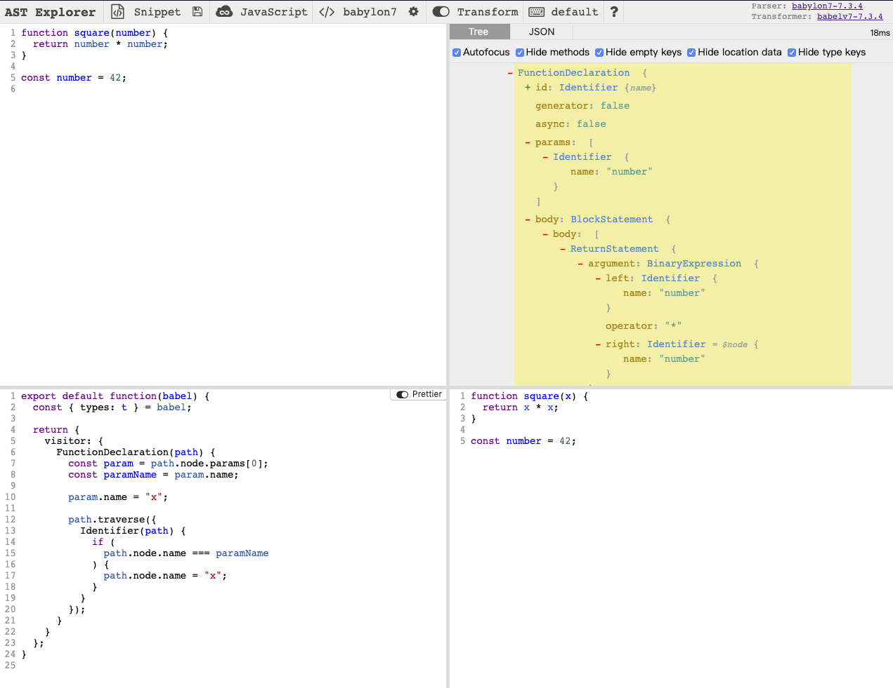

# 跳出工程化看工程化

我最近老在思考一个问题，当我们说前端工程化的时候，我们到底在聊什么？为什么已经在公司分享了那么多次，还有蛮多同学觉得工程化是个黑盒。于是我决定提笔写下这篇文章，尝试从自己的角度来窥探一下，从源码到 JS 被各个「端」执行，这中间到底经历了什么。当然碍于水平有限，有些不准确的地方，欢迎在 [issue](https://github.com/Rainsho/blog/issues) 区提出讨论。

## 一点题外话

佛家说，人生三重境界「看山是山，看山不是山，看山还是山」。写下这篇文章的时候，我已经做了差不多一年前端工程化方面的工作了，颇有「看山不是山」的味道。之前做半年绩效面谈的时候，老大也一针见血的说到我「不自信」，套用比较有名的达克效应 [Dunning-Kruger effect](https://wiki.mbalib.com/wiki/%E9%82%93%E5%AE%81-%E5%85%8B%E9%B2%81%E6%A0%BC%E6%95%88%E5%BA%94) 我猜这个阶段的我也只是刚刚越过「愚昧之山」，正处在「绝望之谷」自然不够自信。


## 上篇：从源代码开始

在 18 年[个人总结](https://github.com/Rainsho/blog/blob/master/articles/%E5%B9%B8%E4%BC%9A%E9%82%A3%E6%9D%A1%E5%A4%A7%E9%B1%BC.md)中，我引用了「any application that can be written in JavaScript, will eventually be written in JavaScript」这句话。得益于大前端概念的蓬勃发展，来到 19 年这个趋势似乎更加明显，团队也开始接手基于 [React Native](https://facebook.github.io/react-native/) 的移动端开发，以及基于 [Electron](https://electronjs.org/) 的桌面端开发。连微软也在今年推出了 [React Native for Windows](https://github.com/microsoft/react-native-windows)，让我们可以用 RN 去开发 Windows apps ，你甚至可以在 [awesome-react-renderer](https://github.com/chentsulin/awesome-react-renderer) 看到基于 React 的运行在各种不同硬件的渲染器实现。

似乎一切能用 JS 实现的，终将会用 JS 编写正在发生。于是，前端工程化再不像以前只需要专注于浏览器端的加载和执行，而是需要面对各种不同的执行环境。这一切初看起来很美好，也很 magic，也会让外人觉得「哇塞，工程化好神奇」。但如果你跳出工程化去看，从源码开始到 JS 能在各个「端」被执行，这期间无非经历了**编译、打包、执行**这三个过程。

### 编译

如果你问一个前端，编译是啥，我猜有一半的人会回答「babel 转码」。老实讲 JS 是门解释性语言 [Interpreted language](https://en.wikipedia.org/wiki/Interpreted_language) ，编译的工作都是在执行的时候实时进行的(不谈 [JIT](https://en.wikipedia.org/wiki/Just-in-time_compilation))。为什么工程化里面还会包含编译这个步骤，甚至可能是构建里面最重要的步骤呢？要回答这个问题，我们先看一下传统意义的编译，一般无外乎以下几个步骤:

```
源代码 -> 预编译 -> 词法分析 -> 语法分析 -> 语义分析 -> 抽象语法树(AST) -> 中间码 -> 目标代码
```

但是前端不一样，更多时候，前端编译只是为了完成以下三个事情: **1. 向下兼容；2. 模块化；3. 代码优化**。所以前端代码从源码开始，经过编译以后还是 JS 代码(或者说更纯粹的 JS 代码)，没有什么中间码、字节码等等，那些是 JS 引擎做的事情。整个过程还是会经过词法分析、语法分析、语义分析得到 AST，然后就是在 AST 的基础上应用各种规则，使得修改后的 AST 能够生符合 ECMAScript 标准的 JS 代码。

所以归根结底，**前端编译就是一个生成 AST，修改 AST**，使得修改后的 AST 能够生成符合预期的 JS 代码的过程。这样讲还是太抽象了，我们结合几个实际的例子，来看下编译过程中到底做了那些操作。顺便看一下，所谓的浏览器兼容性到底是个什么鬼。

1. 向下兼容

向下兼容一般是在构建的初期进行的，以 webpack 一次构建为例，在 `resolver` 开始解析模块前，会将模块交给对应的 `loader` 进行预处理。这个时候便是做向下兼容的时机，通常我们会使用 babel 对其进行处理，进行构建过程中的第一次编译工作。

- 扩展语法支持

  我前面一直说前端编译是从源码开始到 JS 代码的过程，为什么不是从 JS 到 JS 的过程？因为源代码真的不一定是 JS，得益于前端的快速发展，我们能看到的前端代码可能包含 JSX、TypeScript、Flow、CoffeeScript 等各种看起来像 JS 带并不是 JS 的代码，当然也会看到一些虽然是 JS 但还只是提案阶段的高级语法，比如修饰器 `@decorator`。

  如何通过编译支持这些扩展语言或是高级语法？要回答这个问题，我们首选要看一下引入扩展语言会遇到什么问题。比如我们有一段 JSX 代码:

  ```jsx
  const App = () => <h1>hi, there</h1>;
  ```

  直接在浏览器的 console 运行，毫无意外会看到浏览器抛的 `SyntaxError: Unexpected token <`。在浏览器的 console 运行代码就相当于直接把代码给到了 JS 引擎去执行，所以 JS 引擎会对代码进行真正意义的编译，然而在「语法分析」那一步的时候，由于 JS 引擎不能识别单独开头的 `<`，所以抛了语法错误。类似的，如果用 babel 这类 JS 编译器去编译 JSX 代码，在「语法分析」那一步，也会抛出 `Unexpected token` 的错误。所以引入 JSX 带来的问题，就是「语法分析」无法通过。

  所以想要 JS 引擎能支持 JSX 语法，**第一步就是使编译器能够识别 JSX 语法**，进行「语法分析」。显然我们不能修改 JS 引擎，但我们可以修改一些基于特定语言的编译器，比如 babel 来进行语法上的扩展。如果你对 babel 比较熟悉的话一定知道通过添加 `@babel/preset-react` 这个预设，可以使 babel 编译器识别 JSX 语法。这得益于 Facebook 定义了 JSX 的规格 [JSX Specification](https://github.com/facebook/jsx)，而 babel 在 [@babel/parser](https://github.com/babel/babel/blob/master/packages/babel-parser/src/plugins/jsx/index.js) 对其进行了解析。在引入 `@babel/preset-react` 后，之前无法解析的 `Unexpected token <` 就能够被正确的解析为 `JSXElement` 了。

  解决了「语法分析」的问题，我们就可以顺利的生成 AST 了。

  

  接下来只需要**将 JS 引擎不能识别的节点替换成 JS 引擎能够识别的节点**即可，比如 `JSXElement` 节点可以替换为类似 `React.createElement(component, props, ...children)` 的 `CallExpression` 节点。我们甚至可以自己手写这个过程:

  

  这样我们就将 JS 引擎不支持的 JSX 语法转换成了能被 JS 引擎支持的传统的 JS 语法。

  ```js
  const App = () => <h1>hi, there</h1>;

  //        ↓↓↓↓

  const App = () => React.createElement('h1', null, 'hi, there');
  ```

- 兼容性问题

  兼容性问题的本质是什么(我们只聊 JS 引擎层面的)？无非较老的 JS 引擎只实现了低版本的 ECMAScript 标准，比如 ES5，而在我们的代码中用到了比较新的特性，比如 ES6。解决兼容性问题，核心目标就是通过转换，让以 ES6 标准写的代码能够在只实现了 ES5 标准的 JS 引擎上按预期运行。参照工作中遇到的兼容性问题，其中 95% 都只是以下两种情况: **1. 语法不兼容；2. 方法不兼容**。针对第一种情况，可以通过编译解决；针对第二种情况，则需要引入适当的垫片，扩展实现。一个典型的前端项目通常都会覆盖部分旧设备或是浏览器，所以通常在构建的时候都会使用类似 babel 的编译工具转码，并在入口处引入类似 `@babel/polyfill` 或 `core-js` 这种垫片库。两者相辅相成，**并不是任意一个便可以解决所有问题的**。

  - 语法不兼容

    处理语法不兼容通常也有两种情况，比如 `const` 这种变量声明 `VariableDeclaration`，在 ES5 标准里面虽然没有这个关键字，但对应的变量声明 `var` 实际上可以看做 `const` 的超集。要做兼容只需要将 AST 里面，所有 `kind !== 'var'` 的 `VariableDeclaration` 全部转成 `var` 即可。类似的情况还有模版字符串 (\`) `TemplateLiteral`，其可以看做是 ES6 对字符串 `StringLiteral` 的扩展。要做兼容只需要将 `TemplateLiteral` 转换成 `StringLiteral`，并对其中的变量进行简单的 `+` 二元操作即可。

    ```js
    const name = 'Tony';

    /*
     * AST vistor:
     * {
     *   VariableDeclaration(path) {
     *     path.node.kind = 'var';
     *   }
     * }
     *        ↓↓↓↓
     *
     * var name = 'Tony';
     */

    const line = `${name} is Iron Man!`;

    /**
     * type: TemplateElement {
     *   expressions: [Identifier],
     *   quasis: [TemplateElement],
     *   ...rest
     * }
     *
     * 转换思路:
     *
     * new_expression = new BinaryExpression({
     *   operator: '+',
     *   left: Identifier,     // <- expressions[i]
     *   right: StringLiteral, // <- quasis[k], TemplateElement -> StringLiteral
     * });
     *
     *       ↓↓↓↓
     *
     * const line = name + ' is Iron Man!';
     */
    ```

    还有一种情况就比较复杂一些了，仅通过 AST 进行转换是无法实现兼容的，需要一定程度的改变原有代码的结构。比如对 `extends` 关键字的兼容，实际是通过引入 `inherits` 函数并对原 `class` 进行改写实现的。引入的 `inherits` 一般被称为 `runtime` 或者 `helper` 函数，在转换的时候根据用户的配置不同，解析器可能直接将 `helper` 函数的实现注入(这样相对安全，但会使最终代码有大量冗余的 `helper` 函数)，也可能**只注入 `helper` 函数的引用**。如果是后者，请确保**已经在正确的位置引入 `helper` 函数**。

    ```js
    class A extends B {}

    //        ↓↓↓↓

    var A = (function(_B) {
      _inheritsLoose(A, _B);

      function A() {
        return _B.apply(this, arguments) || this;
      }

      return A;
    })(B);
    ```

    诸如上面的代码，`_inheritsLoose` 实际上就是对 `extends` 的兼容实现。但要上面的代码在 `new A()` 时能够执行，要么在当前模块下有类似 `_inheritsLoose = require('@babel/helper/xxxx')` 这样的引用，要么在全局或者当前模块内部有对 `_inheritsLoose` 的实现，比如:

    ```js
    function _inheritsLoose(subClass, superClass) {
      subClass.prototype = Object.create(superClass.prototype);
      subClass.prototype.constructor = subClass;
      subClass.__proto__ = superClass;
    }
    ```

  - 方法不兼容

    相比语法不兼容的情况，方法不兼容就比较直观易懂了。比如我们比较常用的 `Array.prototype.map()` 方法，在 ES5 里面没有实现怎么办？我们可以直接扩展，比如 MDN 上就给了你 `Array.prototype.map()` 的 [Polyfill](https://developer.mozilla.org/en-US/docs/Web/JavaScript/Reference/Global_Objects/Array/map#Polyfill) 实现。整个 Polyfill 的核心思路，就是用当前 JS 引擎已经支持的**语法和方法**，去实现原生暂未支持的方法(**语法是不可能的!!!**)。在不是很严谨的情况下，你大可通过以下几行代码自己实现 `map()` 方法:

    <!--prettier-ignore-->
    ```js
    Array.prototype._map = function(cb) {
      var ret = [];

      for (var i = 0; i < this.length; i++) {
        ret.push(cb(this[i], i, this));
      }

      return ret;
    };

    arr = [1, 2, 3];
    arr._map(function(x) { return x * 2; }); // [2, 4, 6]
    ```

    理解了这个，你就知道为什么多数前端项目的入口文件的第一行一般都是 `import '@babel/polyfill';`。当然这其实是一个很不好的模式，因为各个浏览器或者说各个端的 JS 引擎对 JS 方法的支持情况已经有很详细的统计了，可以参考 [Can I use](https://caniuse.com/)，所以一股脑的引入全量的 `@babel/polyfill` 实际上是很浪费性能的举措(虽然绝大多数垫片方法不会执行，但是 JS 引擎依然需要去编译完整的垫片代码)。鉴于此，babel 在 7.x 推出了 [usebuiltins](https://babeljs.io/docs/en/babel-preset-env#usebuiltins) 选项可以根据 `target` 决定引入哪些垫片。还有 [Polyfill.io](https://polyfill.io/v3/) 则更进一步，会根据用户请求头的信息动态的返回垫片内容，不浪费一丁点性能，这无疑也给了工程化过程中对垫片的处理一个新的思路。

2. 模块化

向下兼容更多的是通过编译将源码转换成了能在更多环境下运行的代码，而模块化的步骤则是通过编译将存在依赖关系的代码聚合到一起。聚合的方式有很多种，这个话题会在下面[打包](#打包)部分具体讨论，而依赖关系的确定无非是对 AST 中和模块定义相关的节点进行解析。常见的和模块相关的节点主要有 ES6 模块 `import`、`export`，CommonJS 模块 `require`、`module`，AMD 模块 `define`。所以在模块化的过程中，只需要遍历这些节点即可，将**导入**方法和**导出**方法替换为**目标代码模块化方案**的实现即可。当然为了合并后的代码有更广泛的适用性，一般模块化工具都会自己实现一套模块化方案来组织代码。比如 webpack 就中意 CommonJS 方案，所以它在对代码进行模块化处理的时候，会做两步工作: **1. 替换导入和导出节点为自己的实现；2. 在整个模块外包裹一层匿名函数**。其中第一步像极了~~爱情~~向下兼容时提到的 `helper` 函数，而第二步则借助闭包巧妙的避免了作用域污染等问题。

```js
// ./answer.js
export default 42;

// 0. AST
{
  ExportDefaultDeclaration: {
    NumericLiteral: {
      value: 42;
    }
  }
}

// 1. ExportDefaultDeclaration -> AssignmentExpression (left = `heleper` 函数)
__webpack_exports__['default'] = 42;

// 2. 闭包并注入 `helper` 函数
{
  './answer.js': function(module, __webpack_exports__, __webpack_require__) {
    __webpack_exports__['default'] = 42;
  },
  ...other_modules
}
```

webpack 对于导出节点的处理可以参考 [HarmonyDetectionParserPlugin](https://github.com/webpack/webpack/blob/master/lib/dependencies/HarmonyDetectionParserPlugin.js#L16)，闭包的处理可以参考 [FunctionModuleTemplatePlugin](https://github.com/webpack/webpack/blob/master/lib/FunctionModuleTemplatePlugin.js#L28)。对 webpack 的 `helper` 函数，我们更多的时候习惯称其 `runtime` 函数，或者 `webpackBootstrap`，有兴趣的同学可以参考我的另一篇文章 [详解 webpackBootstrap](https://github.com/Rainsho/blog/blob/master/articles/%E8%AF%A6%E8%A7%A3webpackBootstrap.md)。

3. 优化

优化实际上是一个很大的主题，这里不想展开。更符合一个 FEer 知觉的说法，应该是代码压缩。相对常见的优化点，比如将方法签名的形参缩短(e.g. `function func(some_meaningful_param){}` -> `function func(x){}`)，或是简化冗余逻辑(e.g. `if( 2 > 1 || other_conditions){}` -> `if(1){}`)。进行这些转换还是离不开编译，而一般的压缩也是通过对抽象出来的 AST 应用各种优化规则，从而安全又准确的完成代码压缩的工作。举个简单的例子:

```js
function square(number) {
  return number * number;
}

const number = 42;
```

我们要压缩 `square()` 方法的形参，只需要 `vistor` 在 `FunctionDeclaration` 内部将所有 `Identifier.name === 'number'` 的 `Identifier` 替换掉即可。这样在 `FunctionDeclaration` 外部即使有与 `square()` 方法形参相同的变量定义，也不会被误替换。



### 打包

打包其实是工程化发展的一个缩影，也见证了前端模块化的发展历程。从早些时候的 [Grunt](https://gruntjs.com/)，到后来的 [Gulp](https://gulpjs.com/)，再到后来的 [Browserify](http://browserify.org/)、[webpack](https://webpack.js.org/)、[Rollup](https://rollupjs.org/guide/en/)、[Parcel](https://parceljs.org/)、[Metro](https://facebook.github.io/metro/)，可谓是[百家争鸣](https://2018.stateofjs.com/other-tools/)。每个工具都有带来自己的理念，但万变不离其宗的就是上面编译部分提到的**模块化**支持。而这些工具对模块化的实现，也大致可以分为以下三种方式:

1. 合并文件流

早期的 Grunt 和 Gulp 都是通过合并文件的思路来实现打包的。这就要求源代码有自己的模块化实现，比如像 jQuery 那样使用 `$` 作为命名空间；或是将模块化方案定义在全局可访问的地方，比如在全局定义 `define()` 和 `require()` 方法的 AMD 标准，然后所有的源码，遵循这一标准，使用 AMD 的模块化方案编写代码。当然如果你的源码足够简单，你可以不需要任何模块化方案，直接合并文件，只要你能保证没有变量冲突即可。

后来的 Rollup 也是文件合并的思路，不过在合并的过程中会对变量命名进行检查，如果后合并的模块内有和之前模块冲突的变量命名，则自动进行重命名的工作。对于不太复杂的项目，特别是 NPM 包这种，通过 Rollup 简单的合并后不会引入额外的模块化 `helper` 函数，而且 Rollup 带来的 tree shaking 方案也会剔除掉未被引用的代码。很大程度上可以减小打包后文件的体积，我想这也是为什么 React、Redux 这些主流的库，依旧在使用 Rollup 就行构建的原因。

2. CommonJS 标准

CommonJS 标准似乎是目前的主流方案，而 webpack、Parcel 是这种模块化方案的代表。他们在打包代码时会遵照上面编译过程中提到的流程，首选将导入和导出节点转换为自身实现的 `helper` 函数，接着借助闭包实现作用域隔离并注入 `helper` 函数。将所有模块打包成 `{[id]: ƒ}` 形式储存，然后在入口处定义 `helper`(即 `runtime`) 函数。这个过程看似复杂，但却最大程度的避免了全局污染以及第三方对源码的入侵。在不做模块拆分的情况下，webpack 打包完的代码执行完后不会在全局定义和暴露任何变量和方法，所有源码中的变量和方法都在各自的闭包作用域内，我想这就是其最大的优势之一吧。

当然有些同学可能会有疑问，webpack 的 `output.libraryTarget` 选项明明是支持 `amd`、`umd` 等一众配置的，为什么说他是 CommonJS 标准的模块化实现呢？其实你仔细看其构建产物就会发现，不同的 `output.libraryTarget` 只是决定了其打包产物是一个自执行时函数，还是将自执行函数作为 [`factory` 方法](https://webpack.js.org/configuration/output/#module-definition-systems)交给对应的模块化方案去调用。其自执行函数内部本质还是一个基于 CommonJS 标准的 `helper` 函数和对应的以 `{[id]: ƒ}` 形式储存的模块代码。

3. AMD 标准

本来我以为 AMD 的标准已经渐渐淡出主流视野了，直到开始接触 [React Native](https://facebook.github.io/react-native/) 的构建，才发现其官方御用的构建工具 Metro 的输出是基于 AMD 标准的模块化方案。其在编译实现模块化的过程中与上面基于 CommonJS 标准的构建工具大同小异，无非是在编译阶段，将所有导入聚合到一个集合内部，然后将所有对导入的引入作为入参传入当前模块即可。这样做的好处是，模块化后的模块(文件)有着类似的结构(形如 `define('id', ['moduleA'], (moduleA) => { ... })`)，并且可以直接合并。考虑到 RN 的 JS 运行时，是在 native 内部启动的 JS 引擎，外部并没有访问的机会，即使将 `define`、`require` 这些方法暴露，也并没有太大风险。而且基于 AMD 的模块方案，让我们可以有更灵活的拆包方案，自由的按需拆包。

```js
// full bundle
define('a', [], () => {});
define('b', [], () => {});
define('c', [], () => {});
define('d', [], () => {});

//      ↓↓↓↓

// split.bundle.1
define('a', [], () => {});
define('b', [], () => {});

// split.bundle.2
define('c', [], () => {});
define('d', [], () => {});
```

4. 未来可期

未来的工程化打包是什么样子的？我猜，**未来可能不需要打包了**。为什么这么说？首先我们考虑为什么要打包，第一 JS 引擎确实没有已实现的模块化方案；第二大型项目动辄 1K - 2K 个模块依赖(因为有打包有模块化方案，前端也会采用分层的架构设计，由此带来逻辑的清晰，但副作用是引用分散)，如果没有打包在浏览器端进行引用是难以想象的。但是这两个问题都在慢慢改变，Chrome 已经从 61 开始支持 `<script type="module">` 标签，而借助 CDN 及 HTTP2，多文件并发请求的效率远远大于单个大文件的请求效率。也正是基于此，诞生了类似 [pika](https://www.pika.dev/) 的基于 ES6 模块化方案的模块管理平台，也许今后你的代码对 Redux 的引用，就直接变成了 `import * as Redux from 'https://cdn.pika.dev/redux/v4';`，更多内容可以参考其官网的 blog [《A Future Without Webpack》](https://www.pika.dev/blog/pika-web-a-future-without-webpack/)。你仔细看那个引用方式，是不是和 ry(Ryan Dahl) 新写的 [Deno](https://deno.land/) 也有异曲同工之妙。

### 执行

最后聊一下代码执行，我认为这是最重要，也是最不重要的部分。基于前面的工作，在这部分只要保证工程化处理后的资源(不仅仅是 JS 代码)能被正确加载就可以了，至于运行代码的 JS 引擎是 V8、JavaScriptCore，还是最新的 [QuickJS](https://bellard.org/quickjs/quickjs.html)、[Hermes](https://hermesengine.dev/)，万变不离其宗的只有 [ECMAScript Language Specification](https://www.ecma-international.org/)。

在浏览器端包括 PC 和手机，我们通常直接把资源丢到 CDN 上去，通过绝对地址引用；在移动端，我们通常将 JS 与资源文件一同打包，由 native 去下载和创建运行时；在桌面端，我们通常直接使用文件系统引用打包后的文件和资源，如此而已。

## 下篇：未完待续(~~还没想好~~)

## 参考文献

所有的引用都可以在正文中找到链接，这里就不汇总了。
